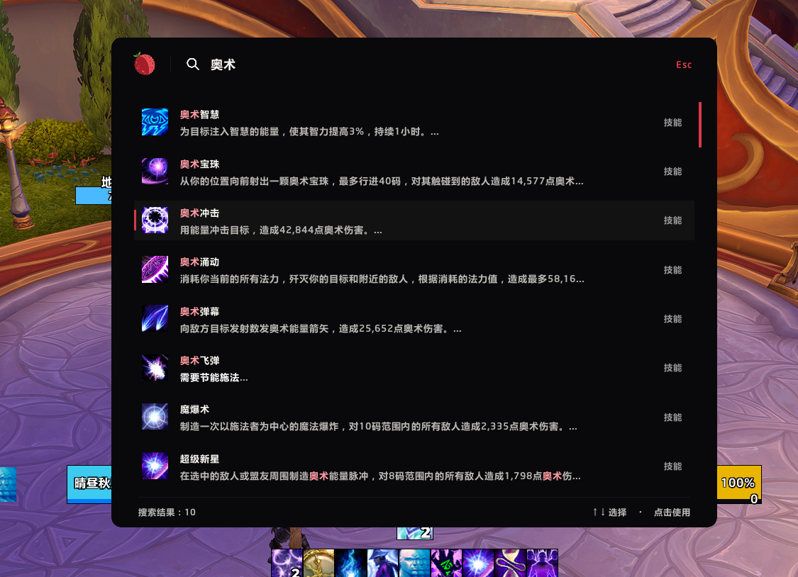
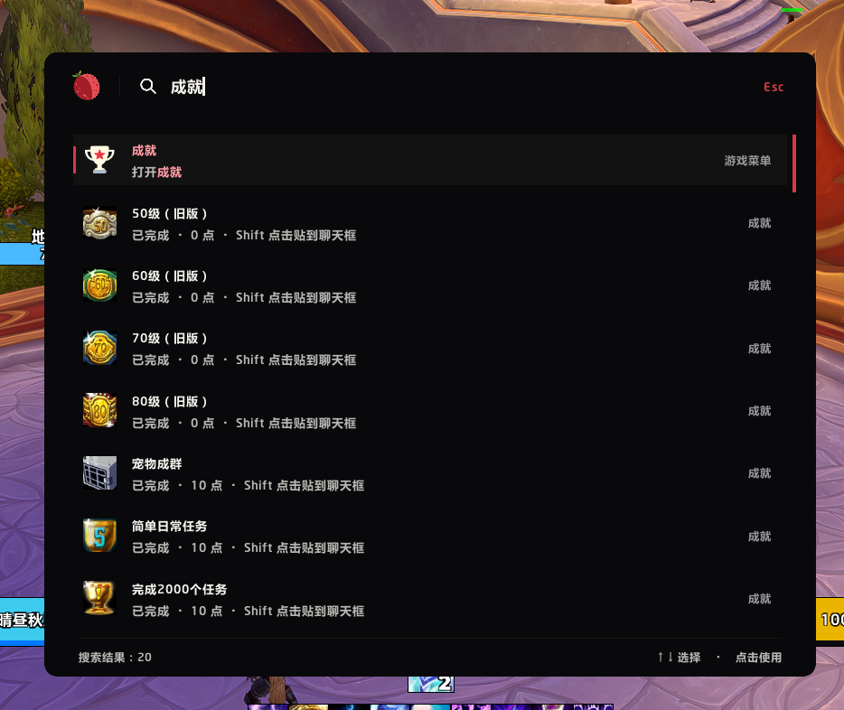
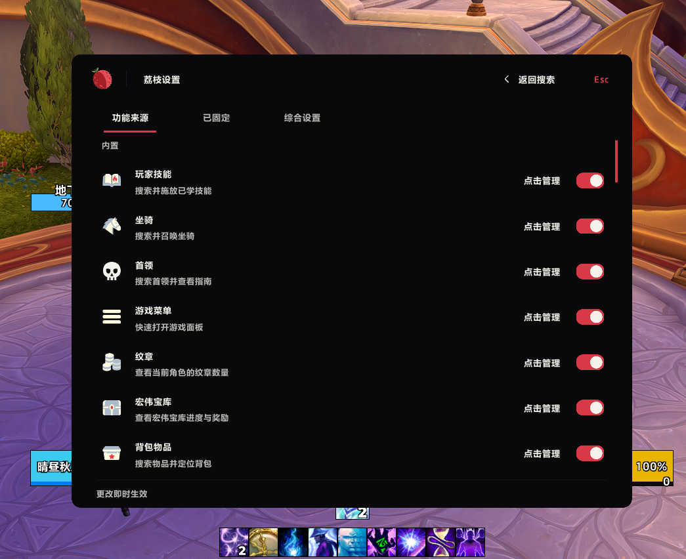

<div align="center">


# Lychee Launcher

**Spells, items, settings. One place to find them.**

Press <kbd>Alt</kbd> + <kbd>Space</kbd>. Type what you need.

[简体中文](README.md) · [English](README.en.md)

[](addon/Lychee/Lychee.toc)
[](addon/Lychee)
[](#clients)
[](#clients)

[](lychee-sdk/docs/en/GETTING_STARTED.md)
[](LICENSE)
[](https://github.com/Follen/Lychee/stargazers)
[](https://github.com/Follen/Lychee/issues)

[Install](#install) · [Try a search](#search) · [Addon settings](#integrations) · [Build a Provider](#developers)



<sub>Captured in-game on a Chinese client · English interface also available</sub>

</div>

You remember a spell's name, but not which action bar it is on. You know which setting you want, but not which menu contains it. Lychee starts with **the name**: find it, then cast, use, switch, or open the relevant page.

<a id="search"></a>

## Try a search

| You want to… | Type… | Then… |
| :--- | :--- | :--- |
| Find a spell your character knows | `Polymorph` | Click to cast, or drag it onto an action bar |
| Find something in your bags | `Hearthstone` | Click to use; right-click for bag location actions |
| Open a game panel | `Heirlooms` | Open the heirloom collection directly |
| Open master volume settings | `Master Volume` | Left-click to open and locate the Blizzard setting; right-click to set an alias or pin it to Home |
| Share an achievement | `Ahead of the Curve` | Shift + left-click the result to insert its link into chat |
| Check the group's keys | `key` | See group keystones and scores (Retail) |
| Search only your spells | `spell: Polymorph` | See matching player spells without other sources |

Spell, bag and achievement results depend on your character and client. A small status message indicates sources that are still preparing. Results for the current query appear as they become ready; one slow source does not hold back every other source.

### Keep the useful things close

- **Pins** put frequent actions on the search home screen. Leave the search box empty to see them.
- **Aliases** give individual results a name you choose. Right-click a portal, call it `home`, and manage your aliases in settings.
- **Remembered choices** favor the result you previously selected for the same query.
- **Match highlighting** marks matching Chinese and English text so you can scan the results.

### Choose where searches go

Open **Settings → Providers → select a provider** to adjust these independently:

| Setting | What it does |
| :--- | :--- |
| General search | Includes this provider when you type a content name |
| Search prefixes | `spell: Polymorph` searches only player spells |
| Shortcut keywords | Assign `abc`; typing exactly `abc` shows that provider's results |

A provider’s search switch only controls whether it participates in searches. It does not unload its addon or stop background features. Explicit references such as pins and recent entries can still be restored when the provider is available.

All three can coexist. **An alias names one result; a shortcut keyword opens a provider's results.** For example, `home` can find one portal, while `key` shows group keystones.

<table>
<tr>
<td width="50%" align="center"><a href="docs/media/search-achievements.png"></a></td>
<td width="50%" align="center"><a href="docs/media/provider-settings.png"></a></td>
</tr>
<tr>
<td align="center"><strong>Find an achievement. Share it.</strong><br>Completion status and chat sharing beside the result</td>
<td align="center"><strong>Choose what belongs in your search.</strong><br>Enable providers and customize their search entries</td>
</tr>
</table>

<sub>Chinese client screenshots. Click either image for the full-size original.</sub>

<a id="integrations"></a>

## Jump into addon settings

On Retail, install the relevant addon and enable its integration in Providers. Then search with a prefix:

| Addon | Example | Destination |
| :--- | :--- | :--- |
| **Ellesmere UI** | `EUI: <setting name>` | An indexed settings page; a section or control when navigation data is available |
| **Ellesmere UI** | `EUI: unlock` | Unlock mode |
| **Exwind** | `EX: <setting name>` | The relevant settings page in registered modules such as ExwindTools and ExBoss |
| **Exwind** | `EX: unlock` | Edit mode |

Both integrations use prefix-only search by default. Prefixes are case-insensitive and accept either `:` or `：`.

The catalog comes from the installed addon's registered data. Settings that have not been built or publicly registered may be missing; these integrations do not promise access to every option.

**Wondering which addon owns a frame?** Search `Addon inspector`. Point at a frame to see its source, or a best guess, in a floating panel that follows the cursor. Hold <kbd>Shift</kbd> for details; press <kbd>Esc</kbd> to leave.

## LDT creature reference (Retail only)

Search creature names, boss names, ability names, or NPC/ability IDs directly. Open a result to inspect its in-game model, base statistics and abilities inside Lychee. Ability matches select the corresponding ability. Global search is enabled by default; `ldt:` is an optional prefix.

The built-in catalogue covers 462 creature records across 16 dungeons and needs no additional addon. Ability text and icons are resolved in the client language; uncached game data may take time to load. Base health and forces are not live difficulty-scaled values. Other clients do not load LDT.

## Raid bosses (Retail only)

Search raid boss names, ability names or spell IDs. Use `bosses:` to restrict the source; prepend `normal`, `heroic` or `mythic` plus a space to select difficulty. Results list supported difficulties and open the corresponding Encounter Journal section. Additional actions select other supported difficulties.

One boss/spell pair produces one result across difficulties. Different spell IDs retain separate identities. Relationships come from a versioned in-game journal capture; older raids without ability sections retain boss entries only. Dungeon bosses are excluded here. LDT currently covers 16 dungeons, not every historical dungeon.

<a id="install"></a>

## Install

1. [Download the repository ZIP](https://github.com/Follen/Lychee/archive/refs/heads/main.zip) and extract it.
2. Copy the entire **`addon/Lychee` folder** into your client's `Interface/AddOns/` directory.
3. Restart the game, enable **Lychee Launcher** in the addon list, and press <kbd>Alt</kbd> + <kbd>Space</kbd>.

Your folder structure should look like this:

```text
Interface/
└── AddOns/
    └── Lychee/
        ├── Lychee.toc
        ├── Lychee_Mainline.toc
        ├── Bootstrap.lua
        └── …
```

This branch bundles its built-in features into one `Lychee` addon. If you installed the multi-addon development version, back up and isolate its old built-in packages using the [conversion checklist](docs/guides/DELIVERY.md#从多包开发版转换) to avoid duplicate registration. Leave independent third-party addons untouched.

**Do not put the entire repository in AddOns.** Players do not need `lychee-sdk`, `docs`, or `assets`. The repository ZIP contains the current development version.

If another binding already uses Alt + Space, Lychee leaves it alone. Assign a different shortcut in the game's key bindings.

| Action | Input |
| :--- | :--- |
| Open search | <kbd>Alt</kbd> + <kbd>Space</kbd> by default |
| Select a result | <kbd>↑</kbd> / <kbd>↓</kbd> |
| Run an ordinary action | <kbd>Enter</kbd> or left-click |
| Open result actions | Right-click |
| Close | <kbd>Esc</kbd> |

Game security rules apply: search cannot open in combat, and protected actions such as casting a spell require a real mouse click.

<a id="clients"></a>

## Clients and languages

One installation includes four client load lists. Each client gets the features it can use.

| Client | Shared features¹ | Mounts · Equipment sets · Achievements | Retail features² |
| :--- | :---: | :---: | :---: |
| **World of Warcraft** | ✓ | ✓ | ✓ |
| **Mists of Pandaria Classic** | ✓ | ✓ | — |
| **Titan Reforged** | ✓ | ✓ | — |
| **Burning Crusade Classic Anniversary Edition** | ✓ | — | — |

¹ Spells, bags, game menus, Blizzard settings and addon inspection. Bag location supports the default Blizzard UI, ElvUI, NDUI and Ellesmere bag interfaces.

² Crests, the Great Vault, talent loadouts, boss journal entries, group keystones, and Ellesmere UI / Exwind integrations.

This is the declared compatibility scope, **not a claim that every client has completed in-game testing**. Entries also check for the required client APIs. See [development documentation](docs/guides/DEVELOPMENT.md) for version baselines.

The interface supports **English and Simplified Chinese**, following the game locale. Traditional Chinese clients currently use Simplified Chinese interface text. Game content keeps the names supplied by the client.

<a id="developers"></a>

## Make your addon searchable

The SDK and Provider API are **1.0.0**. A Provider supplies content and actions; Lychee handles searching, ranking and display. Start with entries and actions. Loading declarations, parameterized calls and catalog tools are optional capabilities for providers that need them.

Third-party addons keep their own code, SavedVariables and media and use the public SDK rather than Host internals. Declare supported clients, register your own English and Chinese text, and provide different implementations where clients differ. See the [loading contract](lychee-sdk/docs/en/LOADING.md) and [Invocation guide](lychee-sdk/docs/en/INVOCATIONS.md) for those flows.

**[Start with the SDK →](lychee-sdk/docs/en/GETTING_STARTED.md)** · [Protocol reference](lychee-sdk/docs/en/PROTOCOLS.md) · [Examples and type definitions](lychee-sdk/README.en.md)

<details>
<summary><strong>Maintenance and verification</strong></summary>

- [Project structure](docs/guides/PROJECT_STRUCTURE.md): runtime, SDK, tools and documentation.
- [Architecture](docs/ARCHITECTURE.md): the boundary between search and Providers.
- [Development](docs/guides/DEVELOPMENT.md): setup, checks and in-game validation.
- [Design](DESIGN.md) · [Performance requirements](PERFORMANCE.md).

Run `pwsh -File tests/check_contract.ps1` at the repository root. Lua 5.1, Python and ripgrep are required. Offline tests do not replace in-game combat, protected-action or visual checks. Most developer documentation is currently in Chinese.

`analyze/` holds local research and is ignored by Git. It is not part of the repository or addon distribution.

</details>

## Feedback and permission

[Report a problem or suggest a change](https://github.com/Follen/Lychee/issues). Include your client, Lychee version and steps to reproduce. For integrations, include the other addon's version too. If there is a Lua error, paste the complete error text.

**Free to use. Credit required for complete, unchanged redistribution. No commercial use. No passing it off as your own.** Publishing modified versions requires written permission, except clearly labeled contribution forks as specified in the license.

Lychee uses a [custom Non-Commercial Attribution License](LICENSE). It is source-available, not open-source licensed. The full license controls; [third-party materials](THIRD_PARTY_NOTICES.md) retain their own terms.

Redistribution credit: **Lychee Launcher — Follen · https://github.com/Follen/Lychee**

### 0.2.5: Slash commands

Search registered ordinary slash commands, including third-party addons, on all four supported clients. Search `dev` or `/dev`, then left-click to run it. Confirmed registering addons supply their own TOC title and logo. Shared AceConsole registrations are observed to identify the actual caller; unknown owners use the command icon. Protected commands and subcommand discovery are not included. English and Chinese locales and `cmd:` / `命令:` prefixes are supported.

### 0.2.6: Generic command ownership

Removed the `/rs` special case. Direct registrations use client provenance; AceConsole registrations track the actual registering object. Titles and logos come from addon metadata, without command-to-addon mappings. Unknown or uncaptured owners retain the command text and generic icon.
