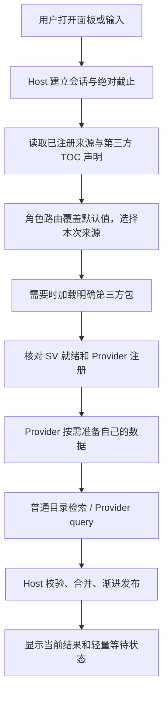

# 单插件版架构与职责

SDK 1.0.0 / Provider API 1.0.0。本页描述当前运行结构与公开合同。迁移背景保留在[单插件功能迁移](architecture/2026-09-14-single-addon-feature-port.md)，实际验证范围见[验收记录](validation/README.md)；历史方案不覆盖现行契约。

## 物理包与逻辑模块

发行运行包只有 `addon/Lychee`。自带功能在 `Builtin/<功能>`，与 Host 同包加载；它们仍有清晰的数据、词表、事件和动作所有者。目录拆分不代表原生按需加载，也不能在窗口关闭时卸载已经加载的 Lua/SV。

第三方是独立 AddOn，拥有代码、TOC、存档、媒体与许可证。接入只通过 `_G.Lychee` 和可嵌入 SDK；禁止依赖 LycheeInternal、Builtin 或 Host 私有素材。自带业务可以复用项目内部装配，但不能让第三方复制装配才能接入。Host 不硬编码第三方名称。

## 各方负责什么

| 角色 | 负责 | 不负责 |
| --- | --- | --- |
| Host | 发现声明、路由、加载协调、当前查询、统一排序展示、动作调度、有界偏好与引用 | 解释第三方业务数据、代管全部业务 DB、猜测 Provider 的缓存失效。 |
| Provider | 事实读取、语言与别名、查询/恢复、动作声明、准备、业务缓存和后台通信 | 控制 Host 根窗口、替 Host 决定其他来源加载、把搜索取消当业务停用。 |
| 独立第三方 AddOn | 原生依赖、客户端文件、SV 时序、媒体、自身启动 | 修改 Host 源码才能被发现，借用兄弟包私有目录。 |
| Action | 一个明确行为、参数 schema、资格检查、执行与结果 | 决定通用搜索生命周期。 |
| Invocation | 某目标 + 某动作/版本 + 规范参数的具体调用 | 以标题或行号代替身份，在预览时执行。 |
| Widget / View | 显示状态、收集输入、绑定当前动作；关闭解除 UI 资源 | 决定插件加载、业务数据预热及持久缓存。 |
| SDK | 公共数据边界、校验、取消、资源及可选工具 | 充当 Lua 安全沙箱或万能业务框架。 |

## 从发现到搜索

原生禁用包不自动启用；产品范围、原生 TOC 与 API 存在性一起决定适用性。静态声明使用版本化 TOC 元数据，加载后核对 ID、所有者、路由和资源。声明格式见[加载合同](../lychee-sdk/docs/LOADING.md)。

设置管理只展示 scope 匹配当前产品、Interface 和 build 的来源。不适用的来源默认不参与搜索；原有角色偏好保留，不能因切换客户端而覆写。Ellesmere UI / EX 集成的缺省参与状态由 EllesmereUI / ExwindCore 核心包的安装及当前角色启用状态决定，按需加载尚未执行不等于未安装。自动默认值只保存在本次加载会话，角色显式开关由 CharacterStore 保存；未安装或原生禁用时默认关闭，不主动加载依赖插件。

打开面板不是加载所有第三方的许可。首页先恢复可见固定/最近引用；可选预热只准备已有明确需求的来源。输入前缀定位指定来源；全局搜索则覆盖其真实参与范围，不能静默漏掉慢来源。准备内容由 Provider 定义；Host 限制协调、剩余时间与取消。

沿用旧 StaticIndex、QueryOrchestrator 与 SearchSession 的渐进基础。已有当前查询结果可立即发布，不等待所有来源统一完成。SourceAccess 只协调发现和准备，不能成为新的全局放行屏障。普通 entries 仍可交给 Host 的有界索引；自有 query、Catalog 和 documents 都是可选路径。

## 搜索开关、关闭和停用

| 事件 | 含义 |
| --- | --- |
| 用户关闭参与搜索 | 排除普通、前缀与快捷词搜索，取消该来源的搜索工作；不停止后台、不调用 onDisable、不阻止明确引用。 |
| 关闭面板 / 换词 | 撤销旧会话 UI 与查询订阅，拒绝迟到结果；不删除用户设置，不声称卸载代码。 |
| Provider SetAvailability(false) | 所有者撤销业务可用性，结束该实例资源。 |
| Unregister | 撤销实例、结果和句柄，旧回调不能复活。 |
| 原生禁用 AddOn | 下一次客户端加载时由游戏决定；搜索偏好不代替它。 |

## 参数动作与界面

搜索给出条目，条目聚合相关 Action。音量属于暴雪设置来源：主音量、音乐、音效等各自是设置目标，设置数值、增减和调整页是该目标的动作分支；不能再多造音量 Provider 或重复普通行。

执行链为：完整引用 → 校验和只读 Prepare → 用户确认/点击 → Invoke → 确认结果 → 写入有界历史。准备与搜索不得修改设置。已提交业务操作有自己的生命周期，关页面只是解除 UI 观察；失败或结果不确定不得自动重试。参数、准备凭据和异步恢复见[Invocation](../lychee-sdk/docs/INVOCATIONS.md)。

空白等待采用轻量状态；旧结果只可作不可操作的视觉过渡，不能计为当前查询首批。零结果、部分失败、超时、加载中分别表达。键盘选择与按下/松开绑定完整身份；不能按行号将旧操作转移给新结果。6→1、1→6、IME、长标题、小视口和关闭重开必须验收。

## 数据、国际化和客户端

框架偏好、固定、别名与最近记录只存有界稳定引用和必要显示回退。Provider 拥有业务设置与持久缓存；内置模块用自己的命名空间，第三方用自己的 SV。已加载 SV 仍占 Lua 堆。迁移先备份，不能因 API 不兼容丢用户数据，见[存储](../lychee-sdk/docs/STORAGE.md)。

Provider ID 与语种无关。品牌中“荔枝”和“Lychee”用荔枝色，显示为荔枝启动器 / Lychee Launcher；文案与游戏本地化见[i18n](../i18n.md)。Retail / classic / titan / anniversary 各自按生成清单和对应原生 API 证据验证，声明支持不代表实机通过。

## 验证与交付

功能覆盖、性能测试、离线契约分别报告，不能互相替代。大改动使用 lychee-dev 做运行时功能覆盖；性能变更按 [PERFORMANCE](../PERFORMANCE.md) 用 lychee-dev 分析时间、全部适用包内存与资源稳定性。无实机证据的项目明确待验证。

现行源码结构见[项目结构](guides/PROJECT_STRUCTURE.md)，交付见[开发](guides/DEVELOPMENT.md)与[交付](guides/DELIVERY.md)。历史架构记录保留当时语义，只作为证据，不能覆盖本页。

## 搜索文档与动作的所有权

SDK 1.0.0 支持完整 Entry 和 `entryMode="documents"` 两种有界索引入口，详见 [目录契约](../lychee-sdk/docs/CATALOG.md)。Host 保存校验后的搜索字段；Provider 保存业务事实，reader 只生成当前候选/明确恢复的完整动作。二者共享既有索引流水线，不额外建第二份搜索目录。物化结果使用弱身份登记，目录版本变更后不能继续执行旧动作。

暴雪设置采用文档入口，只物化普通“打开并定位”动作；不注册设置 Invocation、自然语言解析或直接编辑页面。SDK 的通用 Invocation 协议继续供其他 Provider 使用。简单的技能、坐骑、背包等 Entry 继续共享动作描述符，不因统一设计强制迁移。成就保持角色权威数组，副本/团本保持生成的关系事实，Ellesmere/Exwind 保持有界动态候选。取舍和历史实测见 [数据结构审查](validation/2026-09-19-structural-memory.md)。
