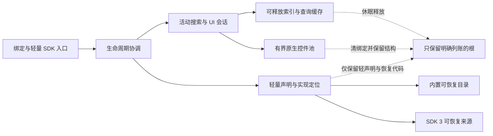

> 历史讨论，已被用户放宽内存目标后的 [当前实施设计](2026-09-12-runtime-lifecycle.md) 取代。SDK 3、拆包和完整休眠均未实施，下面的 1 MiB 不是当前验收门槛。

> 文档维护注（2026-09-20）：仅修复目录迁移后的链接；原路径为 `../../lychee-sdk/RUNTIME_LIFECYCLE.md`。下文保留当时版本、测量与验收结论，不代表当前版本重新通过。

# Lychee 运行时生命周期与低内存重构方案

状态：设计提案，2026-09-12。尚未实现、尚未达到目标；本文不改变当前 SDK 或正式服行为。

当前决策：`LYCHEE-PERF-1789203670` 的同一份落盘报告已通过 `0.2.2-baseline-gate` 全部基准检查：四轮 Provider/搜索、EUI 真实选项、钥石、三次真实 UI 开关及最终采样均完成。现在据此确定下述改造路线。基准通过与产品休眠低于 1 MiB 是两个门槛，后者尚未实现或证明。

决策更新：用户已允许 SDK 破坏式更新。目标采用 **SDK 3 / UI Runtime 2**，不再为旧 SDK 2 保留兼容实现；保留内置业务、用户数据和体验要求。实际运行时仍是旧版，实施时本体、SDK、示例、文档和门禁统一切换。

目标：面板未打开、没有活动需求时，首次使用前和完整使用后休眠的整体常驻分别低于 **1 MiB（1024 KiB）**，同时保持搜索、交互、动画与用户数据语义。覆盖插件本体、SDK、UI 库、构建、文档、测试与实机验收。活动态不受 1 MiB 限制，仍受现有性能门禁约束。

规则入口：[PERFORMANCE.md](../../PERFORMANCE.md)。SDK 配套：[SDK 3 生命周期设计](../../lychee-sdk/docs/RUNTIME_LIFECYCLE.md)。测试配套：[生命周期验收设计](../../tests/LIFECYCLE_ACCEPTANCE.md)。

## 1. 结论与实施顺序

推荐验证“紧凑数据与接收流程 + 明确的数据所有权 + 可休眠的搜索运行时”。先优化重建热点，再决定少量缓存与闲置释放策略；原生按需加载作为降低首次使用前代码成本的候选，不能预设拆包本身降低整体内存。首次使用前与完整使用后两项独立验收。

追加调查见 [完整重建离线报告](../validation/2026-09-12-search-rebuild/README.md)：1476 / 2689 条重建中位约 104 / 194ms，校验是主要调查目标，热查询中位均值约 0.22 / 0.36ms。它不包含真实 API 或 UI，不是游戏打开延迟；不能直接把当前全量构建放到每次开面板。该报告附原始样本、复现脚本、内存口径和未完成的实机验证。

最新[完整实机基准](../validation/2026-09-12-search-rebuild/RUNTIME_RESULTS.md)中，普通完整私有重建受测调用为 4233.503 / 4235.432ms；保留成就缓存后仍为 534.381ms。成就重扫 3702.600 / 3718.821ms，缓存恢复 12.922ms；首领单次同步注册 274.946～285.460ms。先优化接收校验和展开记录，再接入休眠恢复。诊断调度会放大墙钟等待，这些数值不是硬件快捷键到结果的延迟。

**先验证使用后的固定成本，再进行全面改造。** 目前没有证据证明已加载代码、必要控件、用户偏好和必须保留的 SDK 数据合计可以低于 1 MiB。不能先拆包，然后只展示 Lychee 主目录的低数字；也不能让首次搜索缺结果来换内存。

主线按 P0～P6 推进。P0 失败时提交具体保留根、字节与体验对照，继续研究有证据的缩减路径；不得把目标改成“仅首次打开前”或将未达标实现作为完成交付。

### 1.1 本次基准落实到哪些决定

| 已测事实（1789203670） | 方案决定 | 必须防止的回退 |
| --- | --- | --- |
| 生产关闭起点 14438.385 KiB；私有首轮活动→释放下降 11391.129 KiB（约 11.12 MiB） | 分离永久身份、恢复数据、活动记录与索引；休眠切断整个活动对象图 | 私有副本差值不是生产精确可释放量，不能从生产起点直接相减得到下限 |
| 成就重扫约 3.7 秒，保留缓存约 13ms | 保留有字节预算的紧凑恢复数据，以版本/事件失效；释放可重建查询层 | 不能每次开面板全扫，也不能把同一大缓存移到另一包冒充释放 |
| 首领插桩轮校验独占 230.373ms、索引 34.106ms | 构建期生成紧凑静态目录；运行期单次边界校验/隔离后共享内部表示；拆开大批提交 | 外部 SDK 输入仍须校验和隔离，不暴露可伪造的“可信”标记绕过检查 |
| 坐骑 API+临时构造 7.698～8.652ms；完整 Provider 普通轮约 75.5～75.7ms；插桩校验 65.330ms | 优先减少 Host 重复遍历、小表和事务中间副本；动态目录按事件局部失效 | 不以少读未收集项、减少字段或漏动作缩时间 |
| 保留成就后整体仍 534.381ms；仅索引重建约 71～75ms | 先验证存储、接收与索引恢复原型，再决定温态时长；3 秒仅候选 | 不把半秒工作放进按键回调，不靠长温态掩盖睡醒成本 |
| UI 首创建及开关区间生产增加 222.058 KiB；三轮 8 行、几何/alpha 稳定 | 保留现有动画和原生结构，清绑定/回调/context；有界池复用 | 该区间不是所有 UI 的精确固定成本；不反复建 Frame 或重写已确认动画 |
| EUI 实际 81 项，四轮具体选项 Resolve 成功 | 紧凑保留必要定位元数据，或证明可从上游重取；永久 hook 只转发到当前实例 | 睡醒不要求重新访问上游页面；生产不预建设置页补目录 |

### 1.2 执行包与决策出口

1. **P0 做两组最小原型。** 一组测真实加载后的入口、实现代码/工厂、全部已访问 UI 池、用户偏好与必要恢复数据的固定保留；另一组用完整首领/成就/坐骑数据比较紧凑表示与单次接收流程。原型不进入正式服默认流程，用实际保留根解释字节，不以假 Frame 或删业务得到低数字。
2. **冻结恢复预算。** 534ms 是旧实现的优化起点，不是可接受的睡醒目标。同机同目录/查询交替测首次完整结果、最大同步段、帧时间和分配；分别计量恢复、索引发布和 UI 可交互，不能用“面板先出来、结果晚到”宣称体验一致。
3. **所有权与生命周期一起接入。** 数据侧提供完整恢复、原子发布、释放；协调器维护唯一活动代次。关闭立即撤销旧工作资格，动画结束清 UI 绑定，短温态到期释放索引、查询与展开记录；快速重开复用有效缓存，休眠重开从紧凑来源恢复。
4. **SDK 3 / UI 2 一次切换。** 本体、全部内置 Provider、类型、helper、示例、打包和约束框架使用同一新契约。声明只保留轻量身份，UI 只在有效会话中获得能力；破坏接口不破坏隔离、稳定业务 ID 或用户存档。
5. **同一矩阵验收后交付。** 本次完整基准作为旧实现参照；候选实现补测真正冷启动、全部页面池高水位、休眠恢复、硬件快捷键、战斗及存档。每阶段交付前后报告与失败用例，最终合并所有 Lychee 运行包计量。

P0 总账为：入口与声明 + 已加载实现/恢复工厂 + 原生池关联 Lua 保留 + 用户偏好 + 必需紧凑恢复数据 + 其他可达根。派生数据剩余预算为 `1024 KiB - 固定总账`，合计必须严格小于 1024 KiB。当前不能凭空填写各项分配额度；先实测后冻结，并为实际数据规模变化留余量。固定总账超标时先优化固定组织，不能追加拆包或 TTL 掩盖缺口。纹理和引擎对象成本另行记录，Lua 计数不代表其全部内存。

本次不再要求用户重跑已通过的同版全套基准。下一次实机运行应有候选实现或尚未覆盖的明确场景，产生新的决策证据。

## 2. 当前证据和问题定位

基线提交：`ccd1c6a59dc3f431d33a90d7ece044b146545058`。真实客户端 Retail 12.1.0 / build 69587 / zhCN / Lua 5.1。

| 条件 | 已测结果 | 能说明什么 |
| --- | --- | --- |
| 已创建面板，10 次开关前后 GC 后 | 14664.9541 → 14664.1494 KiB，约 14.32 MiB | 本轮没有观察到保留增长；关闭仍保留大部分数据 |
| 同轮目录 | 1982 条，版本 54 不变；结果行池 8 行 | 数据规模与池在这一轮稳定 |
| Provider 与索引 | 1982 条 canonical 对象身份一致 | 这两处已共享记录，不能再以消除一整份重复记录作为预期收益 |
| 首领目录 | 1154 条、6924 张 canonical 及子表、4616 个搜索字段 | 是主要结构压缩候选；表数比例不是字节比例 |
| 64 位离线，仅加载 79 个 TOC 文件 | 1562.8 KiB；未创建面板、未初始化目录 | 当前代码组织仅延迟 UI 创建不足以达标；不是 WoW 固定成本实测 |
| 全局完整 GC | 114～121 ms | 是客户端全局停顿；不能放进生产关闭路径 |

原始测量目前保存在本机忽略目录 `analyze/runtime-memory-20260912-capture.txt` 与同名分析 Markdown。它们不进入运行时或分发包。P0 必须将脱敏原始证据、环境和复现入口正式归档到 `docs/validation/`，不能把本提案的摘要替代验收报告。

本轮样本 `initiallyCreated=true`，没有覆盖真正首次打开；探针直接调用 Show/Hide，没有覆盖 Alt+Space、Esc 的完整分发。64 位离线 Lua 5.1 不是客户端模拟器，32 位旧测试的内存阈值不能直接搬到 64 位环境。

### 代码中的根因

- `Bootstrap.lua:62` 的登录流程注册内置目录，`:92` 的事件处理在脱战时再次进入该流程。初始化、需求与恢复缺少统一协调。
- `UI/Palette.lua:993` 的 Show 负责 UI、会话和动画启动；`:1034` 的 Hide 停会话，`:1068` 的 FinishHide 清显示。它不拥有整个目录、索引与 Provider 的释放策略。
- `PublicAPI/SDK.lua:11` 同步注册 Provider。`Core/ExtensionRegistry.lua:166` 的 Ready 是一次性通知；不是面板活动状态。
- `Core/ProviderRuntime.lua` 在注册时复制并保存权威记录；公开句柄、定义、Registry 和索引相互保活。仅清一个全局变量不能证明整张对象图可回收。
- `UI/ViewHost.lua:30` 已集中 Unmount→Dispose，不能再在外围重复一套清理；Provider 自己缓存的原生控件仍由 Provider 负责。
- TOC 提前执行代码与 SavedVariables 恢复也是常驻来源；“首次创建 Frame”不能代表“首次加载 Lua”。

## 3. 架构选择：加深 module，集中生命周期知识

没有 `CONTEXT.md` 或 `docs/adr/` 可供沿用；本文先定义词汇，不伪造既有 ADR。已有架构文档中的“登录注册目录”与本提案不同，实施时必须明确替换相应段落，不能让两个版本都宣称是现状。

| 领域概念 | 含义 |
| --- | --- |
| 注册身份 | Provider 实例、稳定 ID、用户开关、公开句柄；与面板开关独立 |
| 权威来源与活动记录 | SDK 3 Provider 负责从当前业务状态重建；Host 只拥有活动期校验隔离后的 canonical 记录 |
| 派生数据 | 可以从权威记录或已验证来源重建的编译字段、倒排、查询候选等 |
| 活动需求 | 当前 UI 会话、执行中的动作或明确的使用请求；须有来源和终点，不以旧 SDK 兼容为由保活 |
| 休眠 | 无活动搜索与显示工作，已断开可释放数据的引用；不等于插件卸载 |

### 三项协同改造

| module / 推荐 | 现状与改造 | seam、adapter、depth 与收益 |
| --- | --- | --- |
| 运行时生命周期 / Strong | Bootstrap、Palette、Search 各自启停 → 统一协调需求、代次、加载、恢复、释放和失败 | interface 承载完整状态语义；时钟/加载在 seam 处由真实客户端与确定性测试 adapter 替换。depth 带来 locality，修一次取消顺序影响全部入口，形成 leverage |
| 目录所有权 / Strong | 注册身份、权威记录和编译索引互相保活 → 轻量声明与可释放活动目录分开，Provider 必须提供可重建来源 | seam 在目录读取与提交处，静态首领数据与玩家动态目录构成真实变化。interface 隐藏压缩、恢复及版本提交；locality 集中存储知识，leverage 覆盖所有 Provider |
| 生命周期验收 / Strong | 多个测试手工全量 dofile、普通表模拟 Frame → 真实 TOC 流程与持久 native 对象模型 | 同一 interface 驱动旧/新实现；客户端与离线 adapter 各自报告局限。depth 在场景执行与证据校验，不在增加转发文件；locality 集中测量口径，leverage 覆盖 SDK、UI 和搜索 |

Deletion test：若删除生命周期 module 后，代次校验、关闭顺序与休眠过期判断必须重新散落到多个调用方，说明它具有 depth。若删除后只是少一个转发函数，它就是 shallow module，不应保留。不为每个表各造一个 Manager，不把所有业务实现塞进一个巨型文件。

本阶段确定 SDK 3 的职责、状态与约束，具体函数名和类型在实施前定版。公开变更以新主版本发布；不要求旧 SDK 兼容，但必须明确旧版拒绝、新版错误、寿命及业务迁移。

## 4. 状态机与四个独立状态

用户启用意愿、实现加载、激活有效、面板可见必须分别表达。取消旧全局 Ready 契约。关闭不清用户开关；休眠不注销轻声明；唤醒会建立新激活；目录暂未准备好不是不存在。

| 状态 | 进入条件 | 保留与工作 | 离开条件 |
| --- | --- | --- | --- |
| 冷态 | 登录完成，尚无运行时需求 | 绑定、SDK 3 纯数据声明入口、必要偏好、最小事件；无业务目录与 UI | 明确的非战斗使用请求 |
| 加载/恢复 | 一个有效需求首次进入 | 同一恢复任务；按数量与时间有界构建；保存最新有效意图 | 完整提交后活动；取消则收尾；失败则可诊断 |
| 活动 | 有效搜索、页面或动作 | 完整业务语义、当前索引、有限缓存；事件按实际需要订阅 | 最后一个活动需求结束 |
| 关闭过渡 | 用户关闭或战斗关闭 | 先失效输入与查询；正常路径保留结束动画必需的显示绑定 | 动画结束/中断后清绑定；受保护清理按现有战斗规则处理 |
| 温态 | 正常关闭完成 | 缓存和实例结构短留，旧活动资格失效；无搜索、动画、轮询 | 暂定 3 秒后休眠；重开校验缓存并建立新激活 |
| 休眠 | 温态过期且没有阻止释放的需求 | 清活动实例数据、canonical、索引与临时快照；轻声明、恢复代码、原生池列账 | 新需求从权威来源恢复 |
| 失败/受限 | 加载失败、构建失败或战斗限制 | 不发布半份目录；无无限重试；保留可恢复的正确状态 | 明确重试或适用事件；不得脱战自动打开面板 |

3 秒是待验证的初始产品参数，不是按延时猜“目录已经就绪”。温态期限从关闭完成算起；同一生命周期只保留一个有效过期任务。恢复、关闭与再打开都用独立运行时代次；Provider 实例身份和查询代次继续各司其职。

取消必须先摘除旧工作并使其失效，再执行可能重入的外部回调；返回后重新核对当前代次。迟到的 timer、reply、动画完成与焦点回调均不得关闭新面板、重新加载目录或恢复旧操作。失效回调尽早断开大表引用，不能只留下一个 false 标志而保留整条闭包链。

## 5. 插件本体与加载方案

### 5.1 冷态入口

保留 `Lychee` 稳定 AddOn ID、现有绑定和 `_G.Lychee` facade。入口只承担必要状态、绑定、防重复加载与错误呈现，不引入目录、搜索编译器或整个 UI 库的隐式依赖。

优先验证一个原生 LoadOnDemand 运行时分包，候选名 `Lychee_Runtime`。它是构建方案中的候选目录，不是本轮已经新增的运行时。不要为了每个功能拆出一个 AddOn；只有测量显示有明确加载收益的资源集合才再拆分。

原生加载完成、声明可接收、目录可查询、界面可交互是不同条件。加载完成后如果玩家早已登录，必须完成一次正确初始化，不能等待不会再来的 PLAYER_LOGIN。加载期间 ADDON_LOADED 可同步重入；使用完整已加载状态并做版本握手，防止重复初始化与新旧包混装。

冷入口只提供 SDK 3 的版本检测、有限纯数据声明和永久声明句柄。声明保存 Provider ID、产品与有限入口元数据、运行时 AddOn/实现键；不接受 entries、完整 UI 树、大型语言资源或回调/工厂闭包。声明同步校验但不触发重实现加载。运行时包提供工厂，每次激活恢复实例；工厂和实现代码的固定保留必须计量。

不为 SDK 2 保留 Ready、同步完整注册或冷态全局 UI 的兼容实现。旧 ComponentPanel 的注册前 RuntimeVersion/AsView 调用必须改成轻声明和活动期 UI 2。声明接收、存档就绪、实现加载、目录提交分别表达；UI 能力由当前激活上下文提供。旧主版本明确拒绝，不隐式排队、不加载双实现。

**LoadOnDemand 解决代码何时进入，不负责退出。** 不设计不存在的自动卸载机制，不使用运行时 loadstring/字节码包/压缩源码作为默认解法。清掉可执行函数后还需要可用的重建来源，原生已加载标记不会因为清引用而复位。P0 必须直接测关闭后的代码与控件下限。

原生加载会同步执行目标 TOC 代码，不能假定整段可按恢复批次切片。P0 单独测首次加载调用同步总耗时、最大不可中断段与首开帧时间。超预算时缩减该同步加载闭包或调整有证据的加载集合；后续目录分批的低耗时不能抵销这一帧的卡顿。

### 5.2 使用后休眠

释放顺序：

1. 标记旧会话结束，禁用旧输入与动作资格，取消查询和延迟焦点。
2. 关闭菜单、tooltip、视图会话与安全覆盖的活动绑定；普通关闭继续已有动画。禁止为低内存改动再次重写动效轨迹。
3. 动画结束或中断后，释放结果、首页、设置行与视图 context 的数据引用；保留可复用结构。
4. 温态到期且无新需求时，清候选、Normalizer 缓存、编译字段、倒排、临时目录副本与任务链。
5. SDK 3 的 canonical 和运行实例数据均允许释放；只保留轻声明、用户数据和必要恢复代码。托管活动事件在关闭时已停止；外部业务系统自己的数据和职责仍由其负责，不把它当作 Host 的休眠备份。
6. 记录有限的保留原因与对象数；诊断默认关闭，无新的常驻扫描。

保护动作清理若受战斗限制，沿用最小待脱战清理状态；不移动/重建受保护控件，不复活旧动作。此时单独报告“受限清理未完成”，不能提前将其标为休眠达标。

### 5.3 数据所有权表

| 数据 | 唯一负责者 | 休眠策略 | 恢复与失效 |
| --- | --- | --- | --- |
| 固定、历史、别名、来源配置 | 用户偏好 module | 保留稳定 ID 与真实用户设置，不保存动作/Frame | 角色、语言与版本按现有规则解析 |
| 首领原始目录 | 构建生成数据 | 比较紧凑权威表示与保留恢复工厂的真实总成本；释放展开记录 | 全量业务内容与原顺序等价，不缩目录 |
| 技能、坐骑、背包等 | 对应内置目录 module | 可释放派生快照；最小 dirty 状态有界 | 恢复时读取当前游戏状态；动作执行仍校验当前可用性 |
| 成就可再生缓存 | 成就目录 module | 评估紧凑保存与重建成本；禁止每次睡醒全量卡顿扫描 | locale/build/数据版本失效；完整首查延迟验收 |
| SDK 3 Provider 目录 | Provider 权威来源 + Host 活动存储 | 休眠释放 Host 完整记录；声明不持有目录 | 从当前权威状态完整恢复，原子发布；活动增量与休眠 dirty 分开 |
| 索引/编译/查询缓存 | 活动搜索 module | 无需求后清除；不要残留在句柄闭包、source、监听器中 | 完整构建成功后原子发布，旧代次不可提交 |
| Native Frame/Region/动画组 | UI 池 | 保留有界结构，清活动脚本、业务回调与条目绑定 | 不重复创建；重绑验证身份；保留成本全部计入 |
| 外部回调快照 | 调用方 | Host 可断自己的引用，不能原地清空调用方持有对象 | 尊重现有快照寿命与修改隔离 |

所有缓存同时记录条数、字节/单条上限、键版本、所有者与释放点。没有容量预算的恢复缓存不能进入实现。紧凑存储只在测得收益并通过行为对照后采用，不把每条候选临时还原整记录作为默认搜索路径。

## 6. SDK 与 UI 库

目标改为 SDK 3 / UI Runtime 2，单一新实现，不维护旧版适配器。破坏式更新允许改变注册形态、Ready、句柄权限、回调顺序和 UI 能力时序；并不豁免业务、所有权、错误处理与体验验证。

- 永久句柄只保留声明身份、启用意愿和有限 dirty 状态；活动上下文才允许目录提交、查询和 UI 操作。关闭后旧活动资格失效，重开建立新代次。
- Provider 从游戏/自身当前业务状态或构建期紧凑资源重建。Host 休眠不保存完整权威副本；不能用另一份驻留目录或无限更新队列绕过释放。
- 活动资源通过范围登记，关闭先失效再清理事件、timer、query 与绑定。温态保留缓存不保留执行权限；重新激活校验版本。
- UI 2 只在活动上下文提供；原生结构以稳定视图键和结构版本纳入有界池。休眠清 props、业务回调、state 和 context，不为每次恢复重新建 Frame。
- 旧版明确返回不支持/需升级，有限诊断不刷屏；示例、类型、helper、manifest、内置 Provider 同一轮切换主版本。
- 固定、历史、别名、来源开关及业务 ID 保持；第三方旧集成须迁移才能使用，未迁移引用不删除或改指向。

完整新协议与迁移清单见配套文档。所有 Lychee 自有与伴随包成本仍计入；不能将 Host 新增数据转移到第三方包后宣称达标。P0 仍验证已加载代码/native 固定下限，不无条件保证任意外部实现和无限数据规模低于 1 MiB。

## 7. SavedVariables、打包与升级

旧搜索索引存档是可再生残留，用户偏好不是。按实际读取证据制定版本化迁移，不继承过去某次清库授权来删除当前数据。

1. 在正确的 SavedVariables 恢复阶段读取，先验证旧结构再提交新版本；失败保持旧数据，迁移幂等。
2. 不将大量缓存继续绑定到常驻入口然后宣称冷启动已懒加载。比较紧凑缓存、延迟所属包与不持久化方案的首次延迟及总量。
3. 必须验证首次升级、未打开直接退出、打开再退出、禁用运行时包、写盘后重启以及回滚读新数据。不得只改 TOC 变量声明就假定旧存档不会执行或不会被覆盖。
4. 若需一次性转换，单列升级启动的成本与后续正常冷态；转换不能丢固定、历史、别名或来源配置，不写逐帧迁移逻辑。
5. 构建清单生成完整多目录分发包及四客户端 TOC；校验依赖、匹配版本、加载顺序、文件闭包、唯一归属与 SDK 不入包。不能发布只有入口没有运行时的 ZIP。
6. 当前自动同步只允许 `AddOns/Lychee`。本提案不授权复制候选伴随目录；正式实施必须先把完整目录清单与部署规则定清楚，再按已授权范围提交、同步、比对。旧文件不自动删除。

## 8. 体验与性能同时验收

保持现有面板位置、尺寸、logo、开关轨迹、文字几何、焦点和 Esc 行为。关闭后立刻重开不黑框、不重置动画相位到错误状态、不移动输入框。

首开/恢复不能先展示缺失目录的“无结果”。同一有效输入只保留最新查询，完整就绪前的过渡态不能冒充最终结果；是否出现新的等待文案也属于体验变化。先优化构建与存储，再通过对照确认用户感知一致，不能把“显示得快、结果晚了”写成等价。

预算口径：

- 冷态与完整使用后休眠：各自 **<1024 KiB**，计 Lychee 及所有伴随运行时包；同时报告自然 GC 下的观测值与受控 GC 后的保留量。只在诊断中 GC，不承诺断引用瞬间统计就下降。
- 温态 3 秒不作为休眠采样；等动画和清理完成再计时，确认无任务后测休眠。
- 空闲搜索/动画 OnUpdate、托管活动事件/timer 与积压查询为 0；必要入口事件、未能释放的外部引用逐项列账，不以旧版兼容为由保活。
- 使用前后控件数在同场景预热后稳定；所有首次访问页的高水位均纳入完整使用后预算。
- 首开到可交互、完整首查、休眠后首查、每批最大耗时、热查询及累计分配分别测。P0 用前后交替样本确定现机预算；实施前冻结数值，不能实现后提高阈值。
- 无体验回退采用同输入、数据与显示条件对照。计时噪声单列，不能把大百分比容差当作允许的回退；绝对机器预算在 P0 附原始样本后填写，不凭空承诺毫秒数。

保留旧活动态搜索测试预算及独立全扫描排序参照。新的 1 MiB 目标不能替换成一个更容易通过的空目录测试。

## 9. 逐阶段实施与文件范围

| 阶段 | 插件/SDK/工具变更范围 | 必须交付与出口 |
| --- | --- | --- |
| P0 可行性与基线 | SDK 3 轻声明/激活原型、诊断探针、隔离加载实验、测试适配；不交付功能裁剪 | 冷态/完整使用后固定根清单；代码、native、SV、声明及恢复数据成本；同步加载、完整首查与恢复延迟基线；通过必须具备固定成本缩减与整体目标的可行性证据 |
| P1 生命周期协调 | Bootstrap、Palette、SearchSession、QueryOrchestrator、ViewHost、Motion/Runtime 活动资源连接处 | 一个生命周期所有者，状态和取消顺序回归；不先改动画或搜索算法 |
| P2 数据所有权 | ProviderRuntime、Registry、StaticIndex、Normalizer、CatalogProvider、内置目录 | 保留轻声明与用户数据；活动 canonical/实例/索引可释放；完整重建、紧凑表示与动作等价；休眠 dirty 可恢复 |
| P3 冷启动与构建 | 入口与加载清单、Bindings、TOC 生成器、包版本检查、SavedVariables | 原生加载、迟登录、同步重入、缺包与混包测试；迁移与回滚；完整安装清单 |
| P4 SDK 与 UI 接入 | SDK 类型/helper/示例、视图和 UI 库、所有内置 Provider、manifest | 整体切换 SDK 3/UI 2；旧版本拒绝；新资源与身份契约通过；原业务场景迁移，示例不依赖私有 Host |
| P5 测试与文档收口 | check_contract、真实 TOC fixture、生命周期预算入口、ARCHITECTURE/SDK/PROTOCOLS/DESIGN/DEVELOPMENT/PERFORMANCE | 业务回归迁移到新协议；替换旧调用兼容断言，新增门禁可失败；缺工具/缺实机证据不能绿灯 |
| P6 实机交付 | 受控完整场景、版本证据、提交与同步 | 冷/热/睡醒/战斗/SDK/存档报告，hash 与文件清单，必要客户端重启，明确剩余风险 |

P0 是全面改造门槛，包含 SDK 3 的轻声明、激活资源范围和恢复来源原型。P1 与 P2 先完成可独立测试的所有权设计再集成。P3 不可用来掩盖 P2 未释放的数据；P4 的新协议契约与业务对照从 P1 开始持续执行，最终整体切换而非并存两套。P5 的新夹具在对应实现之前建立失败样本，不拖到最后补测试。

只有差额清单、只有可释放目录实验或只有冷入口小于 1 MiB，均记为 **P0 未通过**。此时可继续有界实验验证代码/native/恢复实现的具体缩减路线，但不能带着未验证差额直接进入面向 1 MiB 的全面实施，更不能把 P1～P6 完成当作目标已实现。

回滚用新的 revert 提交并按同一部署流程同步，不改写历史。存档变更须保留可读的回滚策略；伴随目录残留不能未经许可自动删除，也不能因残留导致入口误加载旧版本。

## 10. WoW 版本证据与尚待验证项

本次 `wowdoc source check` 确认本地与远端一致。以下来源统一为：

- sourceId：`wow-ui-source`；product：`retail`；requestedRef：`latest`。
- resolvedCommit：`8ea15b61e45c0ed4eba01439c90757f86eb78d34`。

| path | line | excerpt 与设计影响 |
| --- | --- | --- |
| Interface/AddOns/Blizzard_APIDocumentationGenerated/AddOnsDocumentation.lua | 347 | `Name = "LoadAddOn"`；接受 `uiAddon`，返回 loaded/value；失败必须处理 |
| 同上 | 322 | `IsAddOnLoaded` 返回 `loadedOrLoading` 和 `loaded`；不能只用前者判定完整就绪 |
| 同上 | 391 | `LiteralName = "ADDON_LOADED"`、`SynchronousEvent = true`；加载路径必须防同步重入 |
| Interface/AddOns/Blizzard_APIDocumentationGenerated/PlayerScriptDocumentation.lua | 1182 | `Name = "IsLoggedIn"`，返回 bool；延迟加载不能依赖再次收到登录事件 |

实施前仍需验证：SavedVariables 跨包归属及写盘/回滚顺序；四客户端加载与受限调用差异；完整使用后的 native/工厂/实现代码固定下限；SDK 3 声明容量和恢复数据成本；全量目录重建最大批耗时与完整首查延迟。Retail 的来源不能替代另三个客户端证据。

## 11. 本轮交付状态

已完成代码审查、真实测量归纳、架构方案与配套 SDK/测试文档。生产 `package/Lychee`、SDK 类型及协议未修改，候选产品包 `Lychee_Runtime` 未创建。另经用户授权创建、提交并安装了独立 LoD 诊断插件 `Lychee Performance Test`，当前修订为 `0.2.2-baseline-gate`，提交 `c800a3d70b128d7eebb36d0fc055ff7193833437`，已取得完整通过报告。诊断包不是产品重构交付；它的代码、私有副本和历史报告成本单列。本方案不是 1 MiB 达标报告。

最新报告在同一轮完成四轮来源/查询、EUI 选项解析、钥石有效记录与搜索、真实 UI 三次开关及最终内存；独立重算基准结果 passed。三个颜色 API 的真实环境、显式 mixin 与真实环境桥接均成功且颜色一致，只有继承全局的私有环境失败，确认旧钥石异常属于探针调用环境。历史失败/中止报告保留；产品全场景与 1 MiB 固定成本仍需 P0～P6 的专门验证。

### 真实集成对生命周期的补充约束

本轮还纳入 Ellesmere UI 和 Exwind 的自有接入，统一调查范围见 [统一实机场景矩阵](../validation/2026-09-12-search-rebuild/UNIFIED_STUDY.md)。两者通过公开 SDK 注册动态 query/resolve，进入规则分别是 `eui:` 与 `ex:`；实现内部仍依赖 Host 的本地化和文字处理工具，不是完全独立第三方 SDK 示例。

Exwind 查询从上游现有声明与静态布局恢复。Ellesmere 页面可枚举，但具体设置项由永久 hook 被动捕获；其选项容器还保留定位所需的 selector/setter。当前代码允许至多 4096 项及约 2 MiB 的累计字符串长度，这只是采集保护上限，不是实际内存预算或目前占用。

因此不能把两者都简化为「关闭清空，打开必能原样再读」。SDK 3 必须先明确具体设置项的恢复来源，或保留有字节预算的紧凑权威元数据；若休眠后必须重新访问上游页面才能搜到原有设置项，就是业务回退。永久 hook 的闭包若一直捕获整个 Provider，也会保活实现和元数据；轻量转发与活动实例分离需要单独验证，不能假设注销自动解除 hook。

新版实机准备从 Ellesmere 9.1.8 的 `EllesmereUIUnitFrames / Main Frames` 页面实际捕获 81 项，最新四轮各解析成功一项，`eui:冷却` 返回 4 项。证明这一页的真实元数据可经现有 Capture 与 SDK 恢复查询；不证明所有页面/变体可恢复，也不允许生产为建立索引提前打开设置页面。后续实验须以已知真实选项 ID、标签、导航参数及动作约束为参照，在休眠后无需重新访问页面的条件下复核。

本轮仅调查和可行性方案。后续正式重构必须先新建分支，再实施 P0 验证；当前未提交的文档与诊断产物保留，不擅自清理或回滚。
