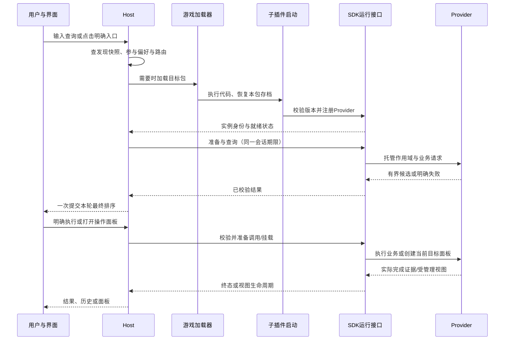

# 子插件加载、搜索等待与参数调用：统一实施计划

状态：设计提案，尚未实施。依据本轮用户确认整理；当前运行协议仍为 SDK / Provider API 1.0.0。本文的接口名称、加载声明和动效参数均为拟议合同，不能当作当前能力使用。

阅读顺序：先看第 2 节理解各方职责与通信，再看第 3–7 节的完整流程；实施负责人按第 8–9 节拆工作和验收；第三方文档作者按第 2.4 节交付公开材料。第 10 节记录独立审核结果。

## 1. 要解决的问题与已确认边界

本计划合并三个工作面：子插件发现/加载与 SDK 生命周期；搜索延迟时的稳定显示；[参数化调用与 Provider 自建操作面板](2026-09-13-invocations-and-provider-panels.md)。后者的动作模型、校验、安全执行、持久恢复和自建控件设计继续作为详细附件；本计划明确其加载前提、搜索开关语义及实施顺序。

用户已确认：

- 设置中的来源开关只表示“参与搜索”。关闭不卸载插件，不停止上游插件或独立后台通信，不取消已经提交的业务操作。
- 第三方适配包和自带子插件采用同一公开接入约定，Host 不能逐个写第三方加载分支。
- **所有自带子包都按独立第三方身份设计和验收。** 作者、代码仓库、发布节奏可以不同；Host 编写时不需要知道它们的业务、名称或未来有哪些包。不能给自带包保留未公开的发现、注册、准备、面板或执行捷径。
- 需要一份整体计划，并由一个独立子 Agent 审核；本轮不实施运行代码、不更新游戏副本。
- 搜索过程中不能再出现大块空白，也不能先摆出一个候选、随后把它挤到下面。

建议采用：按实际路由加载、有限预热、结果一次提交、等待状态与业务结果分开。打开面板不默认加载所有包。品牌表达沿用现有深色界面和荔枝色，不用醒目的旋转 Logo 掩盖等待。

## 2. 已核对的事实，不能混为一谈

| 事实 | 依据与影响 |
| --- | --- |
| 当前五包均未声明 LoadOnDemand | `addon/` 的五包 TOC；拆所有权不等于按需加载，当前搜索延迟不能直接归因于“子包首次加载” |
| 当前来源开关会停用 Provider | `Core/ProviderManagement.lua` 的 SetUserEnabled → Registry；`Core/ProviderRuntime.lua` 的 stop 会关闭资源、结束任务并调用 onDisable。因此“只控制搜索”是用户确认的目标语义，当前代码需要修正，不能声称已经做到 |
| 已有打开/关闭通知 | `PublicAPI/SDK.lua` 的 ObservePalette 只通知已经加载的订阅者，不能发现或唤起未加载包 |
| 旧设计有加载前声明 | [旧接入规格](../comet/specs/sdk-integration/spec.md)、[旧发现设计](../comet/specs/command-platform/spec.md)：TOC 元数据、轻量候选、选中后加载再确认注册。历史检索没有找到对应通用运行加载器；不能称为“已实现后删除” |
| 当前正式架构没有 Host 通用发现 | [五包记录](2026-09-13-provider-sdk-1.0.0.md) 将第三方加载交给接入方；本计划是对此作明确变更，不恢复退役的 Extension/Commit API |
| 搜索先清空，完整结果稍后提交 | `Search/SearchSession.lua` 开始新输入发布空结果；Palette 模式切换隐藏首页。原子发布修复了中途重排，但未解决等待中的视觉空洞 |
| 钥匙通信可以主动补查 | `Lychee_Player/Keystones/Provider.lua` 启动/查询请求队友数据；当前发送路径战斗中短路。按需加载可能增加首查等待，不等于数据必然补齐；要持续回应队友才需要独立提前运行的接收部分 |

视频是用户可见现象；代码链路和既有离线复现证明“等待时清空”的路径，尚未用客户端 profiler 证明所有延迟的来源。实施前分别计量包加载、SV 恢复、目录准备、名称请求、路由和渲染，不预先归罪于其中一个阶段。

### 2.1 先明确名词：它们不是同一层

- **Host**：荔枝主插件运行时，承接用户入口、来源发现、加载调度、搜索合并、通用界面和执行入口。它也是一个 AddOn，但不拥有其他来源的业务目录。
- **子插件 / 适配包**：游戏加载和 SV 归属的单位。一个包可以注册多个 Provider；加载包不等于启用其中每个搜索任务，关闭某个来源也不能卸载共享包。
- **Provider**：一个搜索和业务能力的所有者，以稳定 ID 注册。负责自己的数据、动作、目标恢复和业务面板。它不是一份 TOC，也不是 UI 控件。
- **SDK**：接入合同、类型、文档、示例及可选公共工具的交付集合；部分运行能力由 Host 提供，部分 helper 按既有方式嵌入调用包。SDK 不是另一个必须安装、会自行运行的游戏插件。
- **Adapter**：第三方作者编写的业务映射代码，将上游插件真实、经过核实的能力转换成 Provider 的声明和调用；可放在原插件内，也可单独打成适配包。
- **Widget / 通用控件**：负责展示和局部交互。Provider 自建控件可以管理自己的草稿和焦点；实际业务提交通过 SDK 调用入口。控件不决定包加载、不管理全局目录。
- **游戏加载器 / 上游插件**：游戏加载器实际执行包代码并恢复其 SV；上游插件拥有自己的功能与设置。Host 不能把 SDK 契约说成可强制控制任意上游代码的沙箱。

### 2.2 职责、输入、输出与数据所有权

| 参与方 | 接收什么 | 必须完成什么 | 交给谁、交付什么 | 不归它管 |
| --- | --- | --- | --- | --- |
| 第三方作者 | SDK 版本、声明格式、上游公开能力 | 选择包结构；声明来源/搜索范围/依赖；实现 Provider；验证冷加载、取消和存储 | 包声明交 Host；运行定义经 SDK 注册；业务调用交上游 | 不调用 Host 私有表，不用 label 猜可写设置 |
| 适配包启动代码 | AddOn namespace、依赖和自身 SV 就绪 | 最小初始化；取得支持版本的 SDK；按来源注册；绑定自己存储 | Provider 定义与自己数据层 | 不在 TOC 顶层预建所有索引/面板；不负责 Host 排序 |
| Host 发现/加载协调 | TOC 声明、搜索参与偏好、明确用户意图 | 校验发现；选择必要包；加载去重；跟踪注册/依赖/就绪/失败 | 当前请求对应的可用 Provider 集合与状态 | 不构建业务索引，不猜第三方函数，不接管上游启动 |
| SDK 运行接口 | 注册定义、具名请求、结果及取消 | 校验/隔离/实例身份、资源和调用合同、错误归一化 | Provider 得到受限 context；Host 得到已校验数据和状态 | 不推断业务成功，不强制抢占第三方 Lua |
| Provider | query/准备/恢复/执行/面板请求 | 维护自己的事实/索引；返回候选；解析参数；提供动作成功证据；创建当前目标面板 | 有界结果给 Host；完成状态给 SDK；局部视图给容器 | 不写 Host 历史，不控制其他来源，不替 Host 改候选位置 |
| Host 搜索会话 | 用户输入、来源状态、各来源候选 | 冻结本轮覆盖、取消过期任务、排名合并、原子提交、等待/失败状态 | 当前身份与可显示结果给 Palette | 不执行业务动作，不直接抓 Provider 私有数据 |
| Palette / Widget | 当前展示状态、有效动作上下文、主题 | 布局、焦点、可用性、等待提示、点击意图 | 输入/导航/用户确认交 Host 入口 | 不写加载策略，不靠动画计时决定数据 ready |
| Host 执行/历史 | 用户确认、有效 PreparedInvocation、完成证据 | 最终权限核对、统一 dispatch、终态至多消费一次、保存稳定调用 | 实际业务执行交 Provider；显示/历史更新交界面和存储 | 不以没抛异常当成功，不保存业务 DB/当前值副本 |
| Provider 数据层 / 上游 | 业务读写、事件、自己的 SV | 真实业务操作、版本迁移、失效与必要后台维护 | 可核实事实/结果回 Provider | 不由搜索参与开关直接控制 |

从外部看，开发者只需理解“声明包 → 注册 Provider → 实现所需能力 → 返回可取消结果”，不需要了解 Host 私有模块之间的调度细节。内部模块复杂度由 Host/SDK 承担。

### 2.2.1 双方如何沟通，为什么 Host 不需要提前认识第三方

双方在代码和数据所有权上独立，但在同一客户端中按公开合同对接。这里的通信是“静态声明＋运行时接口”，不是队伍聊天消息，也不是允许 Host 读取第三方私有全局表。

| 时机 | 第三方提供什么 | Host 如何知道 | Host 不需要知道什么 |
| --- | --- | --- | --- |
| 包还没加载 | SDK 规范格式的 TOC 说明：协议版本、来源身份、默认搜索入口和依赖 | 通用发现模块通过游戏元数据接口读取；不执行第三方代码 | 上游插件业务、内部模块和索引结构 |
| 包已经加载 | 通过公共注册接口提交 Provider 的能力和回调 | SDK 校验并授予当前实例句柄；Host 只认合同 | 回调内部调用了哪些上游函数 |
| 准备/搜索/执行 | 接收规定形状的请求，返回规定形状的状态/结果 | SDK 关联实例、会话、取消和完成 | 第三方如何建索引、怎样实现业务 |
| 用户改搜索入口 | Host 在该来源稳定 ID 下保存自己的前缀/范围偏好 | 通用路由模块合并角色偏好与第三方声明的默认值 | 第三方业务设置；不修改第三方源码或业务 DB |

“编辑路由”只指用户把来源的前缀、快捷词或搜索范围改成自己习惯的值。来源是谁、原始入口是什么，来自开发者提交的声明；用户修改的是 Host 偏好。Host 发布后，张三可以另行发布一个此前不存在的适配包，符合协议就应被发现、加载和调用，荔枝无需发新版来增加它的名字。

内部五包仅是本仓库当前发行装配，不是 SDK 的固定生态清单。构建/交付工具可以知道本项目打包哪些目录；运行 Host 不得使用这份发行清单作为第三方发现注册表。包内自有 helper 可以保留私有实现，但对外必须走公共接口，不能要求别的作者采用同一套文件结构。

### 2.3 一次操作如何流转

图中的注册和 SV 就绪可以先后发生；Host 必须等本次能力所需条件都满足，不能假设“注册了就能读存档”。需要自身 SV 的 Provider 应由包启动代码在就绪后注册，或明确报告 notReady。

| 关键入口 | 谁发起 | 谁负责收尾 |
| --- | --- | --- |
| 打开/关闭搜索 | Palette 通知 Host 会话 | Host 结束查询与等待视觉；SDK 结束纯搜索作用域；Provider 保留仍有其他需求的合法业务资源 |
| 来源开关 | 设置视图提交稳定 Provider ID 与参与值 | Host 保存角色偏好并刷新路由；不沿用 runtime stop |
| 右键面板 | 用户明确导航交 Host | Host 挂载容器；Provider 创建/解绑控件及观察；SDK 管资源和实例授权 |
| 点击固定调用 | Host 读稳定引用并找所属包 | Provider 迁移/恢复目标；SDK 重新校验参数；用户执行后才允许业务写入 |
| 真正停用/注销 | Provider 所有者或运行实例失效 | SDK 撤销该实例的任务、视图、执行权限；Host 拒绝所有旧回调 |

### 2.4 SDK 文档必须交付到什么程度

实施时更新正式 SDK 文档与可运行示例，不让第三方开发者靠阅读本仓库的日期提案来接入。下列为文档交付清单，尚未发布为当前协议：

| 文档/材料 | 读者读完必须能回答 |
| --- | --- |
| SDK README / CATALOG | Host、SDK、包、Provider、Adapter 各是什么；哪些能力稳定、哪些可选；是否需要额外安装 SDK |
| GETTING_STARTED | 从空适配包到首次查询的完整目录/TOC/注册示例；依赖与 SV 顺序；中英显示；游戏中如何验收 |
| 新增 DISCOVERY_AND_LOADING 专题 | 加载前声明每字段的类型、上限、默认值、版本、错误；全局与入口的差异；包/来源一对多；哪些触发会加载；没有声明如何兼容 |
| PROTOCOLS + ApiStubs | 每个接口是谁调用谁；参数与返回所有权；同步/异步回复次数；取消/重入/错误；版本兼容；准备、查询、执行的区别 |
| RUNTIME_LIFECYCLE | 搜索参与、实例运行、包加载三张状态表；各阶段创建/停止什么；关闭与卸载区别；后台职责如何独立 |
| STORAGE | Host 偏好与子包业务 SV；加载/迁移顺序；缓存失效与保留；损坏/未来版处理；不能随包切换丢存档 |
| 调用与自建面板专题 | 目标/动作/具体调用关系；参数校验、补参、连续编辑、完成证据；自建控件如何挂载、处理主题、焦点、取消与恢复 |
| COMPATIBILITY / ERRORS | 旧新 Host/Provider/发现声明组合；临时不可用、未就绪、缺依赖、冲突、已删除、版本不支持；开发者诊断与用户文案分开 |
| 公开示例与验收脚本 | 独立 ABC + ABC_Lychee 冷加载；一个包多个来源；异步取消；全局/入口查询；只关闭搜索；普通动作和不同控件面板；业务存储 |

每个专题采用固定顺序：使用场景 → 职责图 → 最小例子 → 完整时序 → 参数/状态表 → 失败和取消 → 容量与性能引用 → 可运行验证。给出“开发者必须做”和“Host/SDK 已代办”的并排说明，不能只列函数名字。

示例只使用正式公开 API，不访问 LycheeInternal，不复制项目内部 Modules/Manifest 装配。测试从示例实际 TOC 和未加载状态开始，不由测试夹具偷偷补注册字段或先加载全部包。SDK 包含文档、类型、helper、示例、构建清单和版本核对；其中任一缺失都不算完成接入交付。

## 3. 三种状态必须独立

| 状态 | 所有者 | 改变什么 |
| --- | --- | --- |
| 搜索参与 | Host 角色偏好，按稳定 Provider ID | 是否进入搜索路由、查询和推测性搜索预热 |
| Provider 可用/运行状态 | Provider 所有者与 SDK 实例生命周期 | 依赖缺失、主动停用、注销、实例替换；真正停止时清理其资源 |
| 包是否已加载 | 游戏加载器；Host 只在合法触发下提出加载请求 | Lua/SV 是否进入当前客户端会话；关面板不能卸载已加载代码/SV |

来源开关的精确定义：

- 关闭后取消该来源未完成的搜索/纯搜索预热，将其移出当前结果并重新收敛；不调用 Provider onDisable，不关闭该来源已打开的业务面板，不终止已 dispatch 操作。
- 固定项、最近记录和明确的已保存调用保留；它们是用户明确入口，不自动删除或失效。点击时仍可按需加载并恢复。空白首页只展示稳定引用/显示回退，不为显示全部固定项就加载全部包。
- 无分类搜索、来源分类搜索及搜索前缀均遵守参与开关；关闭来源不因输入前缀自动重新开启。显式固定入口和搜索路由是不同操作路径。
- 别名命中、搜索中的最近调用建议、参数候选和补充候选同样属于搜索，统一通过参与集合过滤；不能经 Personalization/Resolve 旁路让已关闭来源重新出现在搜索里。只有用户明确点击保存入口的恢复请求允许绕过搜索参与限制。
- 原插件的队伍消息、独立设置、必要业务事件不归搜索开关管理。仅服务于搜索的观察与临时索引在没有搜索需求时可以停止。
- 真正所有者停用、注销、客户端禁用插件、实例失效仍是强生命周期事件，继续执行安全撤销和资源清理。

存档与兼容：新增明确的 searchParticipation 偏好语义，名称在正式类型阶段冻结。旧角色的关闭选择迁移为不参与搜索；不得复用这一 false 值继续驱动 runtime stop。先验证旧根和 schema、在副本中迁移、成功后原子提交；未知/损坏/未来版本原文保留并停止破坏性回写。具体旧键映射由 CharacterStore/ProviderPolicy/Registry 联合用例验证。

旧 API 1.0.0 的所有者停用及 onEnable/onDisable 合同保留；新 Host 的界面开关不再调用旧的用户停用链路。迁移解除旧用户停用位时可能使已加载 Provider 恢复运行，必须单独测量这一代价，并先把自带 Provider 的重搜索初始化从 onEnable 中拆出。第三方旧 Provider 无法被 Host 强制改成轻初始化；不能隐式篡改其回调或宣称零成本兼容。

## 4. 加载前发现：SDK 声明，Host 执行

### 4.1 声明的最小信息

采用 WoW 可在不执行包代码时读取的 TOC 元数据。SDK 发布声明格式、校验工具和独立第三方例子，不要求第三方复制本项目 Manifest/Activate 装配。

| 声明信息 | 用途 |
| --- | --- |
| 发现协议版本、包内 Provider ID 清单、来源显示回退 | 未加载也能识别来源和保存参与偏好；发现版本与 Provider API 版本分开 |
| 目标客户端、依赖与就绪条件 | 不加载不适用或缺少依赖的适配包；普通包依赖由原生 TOC 表达，不再发明另一套依赖图 |
| 默认搜索范围：全局或明确入口，默认前缀/关键词 | 无角色覆盖时路由到包；关键词只表示入口，不保证覆盖未知业务内容 |
| 恢复归属 | Provider ID 到包的映射，供固定项/最近/具体调用恢复使用 |

字段编码、单字段长度、来源数、总逻辑字节、冲突处理在实施阶段 A 冻结，容量数值只进入 PERFORMANCE.md；不执行元数据中的 Lua，不让声明携带回调、控件、整份目录或业务 DB。Host 只存发现/路由元数据，不持有完整 Provider 索引。

发现列表按当前安装集合建立会话快照；不按每次输入遍历插件。发现可分批，公开就绪状态；未完成发现不能假报“全局无结果”。重复包声明同一 Provider ID 时标记冲突，禁止靠先后顺序抢占，不能覆盖已注册实例。用户在游戏插件管理中禁用的包不自动启用。

加载成功至少经过：声明有效 → 依赖可用 → 包加载完成 → 对应 SDK 版本支持 → 正式 Provider 注册并核对归属 → 自己的 SV 就绪 → 本次所需数据准备。已加载不等于可搜索；不匹配、注册缺失、版本不支持分别报错。一个包的多个 Provider 独立判断就绪；未声明且已通过旧合同注册的 Provider 继续按旧接入运行。

没有发现声明的未加载第三方包不能被凭空猜到，仍由上游自己的入口加载；一旦注册即进入当前能力集合。新接入文档明确区分这条兼容路径和可被 Host 唤起的新路径。

统一有效路由按“搜索参与开关 → 有效角色覆盖 → 声明默认值”计算。当前 ProviderPolicy 允许用户修改全局参与、前缀和快捷词，此能力继续保留；TOC 中的范围是默认值，不是禁止用户修改的能力上限。发现注册表和已加载 Registry 通过同一个 ProviderPolicy 入口生成快照，不能冷时看 TOC、热时另算角色设置。加载后运行声明的默认值需与包元数据一致，漂移标记为接入错误，保留用户覆盖，不静默切换路由。来源设置在包未加载时也能保存/重置有界路由，不为编辑配置强制拉包；与所有已发现和已注册来源一起校验入口冲突。

### 4.2 加载/预热选择规则

第一版采用可解释的确定性规则，不加入使用频次、时间戳或预测模型：

1. 打开面板：显示首页；准备已加载、参与搜索来源的必要轻量状态。冷包默认不因开窗而全部加载。可见最近/固定入口对应来源按现有顺序成为有界预热候选，额度未冻结前默认不执行冷包推测加载。
2. 明确来源/前缀：只路由到符合参与开关的相关包；用户显式入口优先于推测准备。
3. 全局查询：所有有效路由设为全局且参与搜索的来源都在本次覆盖范围内，必要时加载它们。不能只查近期来源却宣称全局搜索完成；某些包没加载的内存收益在这一步可能消失。
4. 明确固定/最近/Invocation：按稳定 Provider ID 找包并恢复当前目标，不用显示名称猜包，不顺带预建其他目标面板；参与开关不阻断这一显式入口。
5. 打开操作面板：仅准备当前目标的动态能力、状态和控件。点击前不预建真实面板，也不枚举所有可能参数。

有效“全局参与”是搜索合同，不是预热建议。新第三方默认全局或用户将其改为全局时，第一次全局查询就承担准备成本；默认入口模式的成本差异需明确告知接入者。不得把当前自带来源从全局悄悄改成入口限定，或忽略角色自定义范围来获得性能收益。

关闭面板取消未开始的推测加载与搜索准备；已经进入原生加载调用的包不能中途卸载。重新打开复用合法缓存和加载状态，重新建立会话身份。成功缓存按数据版本失效，不能用旧 session 的 ready 回调恢复新窗口。

### 4.3 后台功能与五包落地

本轮不增加第六个自带包。Host 保持通用职责，自带四个子包以真实 LoadOnDemand 为目标；修改 TOC 前按各客户端 wowdoc 证据验证。不得为达到这个目标把 Player 的业务通信搬入 Host。

- 技能、背包等在首次需求时读取当前事实；事件是否只需活动时监听，按可补查性逐项审计。
- 队伍钥匙第一版建议按需求启动通信并补查，明确未使用时不额外提供持续应答；如果必须维持此前持续回应队友的产品行为，应先提出独立轻量启动包装配变更及预算，不能默默丢失功能，也不能偷偷把整个 Player 改回登录加载。
- EUI 等早期注册捕获必须先验证是否有可重放的声明/公开枚举接口；能重放才可延后，无可靠接口则由上游/轻量适配启动部分提前捕获。保留完整入口覆盖是切换其 LoD 的前置条件，不能以“懒加载”掩盖漏目录。
- 无独立后台职责的包直接走按需路径。第三方原插件的启动策略仍由其作者/游戏管理，荔枝的搜索来源开关不能代管。

这两项后台/捕获取舍是实施风险，不是已有授权的行为变更。先审计和验证可补查性；若五包结构内无法兼顾，停在该包切换前明确列出方案，不阻塞其他不依赖它的工作。

## 5. 加载后准备与资源：小接口，明确状态

拟议 SDK 搜索准备钩子 prepareSearch(context, reply)，context 只提供已校验路由、原因、会话代次与复用的托管作用域；返回可取消句柄，允许同步 ready。Provider 自己决定要准备哪些索引，SDK 不读取其内部表。

- Provider 实例、搜索准备、query、view、已提交 operation 是不同作用域；复用现有 Resources 实现，不新建平行 timer/event 管理器。
- 同 Provider 同准备键最多一个有效构建任务；预热和正式 query 共享它，正式需求提升优先级，不另起重复全量构建。键包含实际影响数据的角色、语言、客户端和目录修订。
- 查询变化可以淘汰旧查询专用工作；公共目录构建只有仍有合法需求才继续。多个等待者各有取消句柄，最后一个离开才终止纯搜索准备。
- prepare 只读、构建搜索必要数据；不写业务状态、不打开上游 UI、不请求受保护执行。详细说明、模型和操作控件按目标需要再取。
- 所有结果与取消先校验代次/实例，先摘旧任务再回调；取消重入不能关闭新任务。无活动需求时停止所有搜索驱动。
- 缓存由 Provider 持有并遵守其已有存储/目录预算。卸载视图不等于删存档；关闭窗口不强制 GC，不承诺卸载代码。

调度器只提供合作式批处理、去重、额度和队列；不能抢占第三方同步 Lua 或原生 LoadAddOn 的长调用。包顶层/SV 迁移必须轻量，重目录任务必须自行让出；逐包测量最慢同步调用。战斗受限的任务转为明确 deferred，不循环重试，恢复事件仅触发一次有效重试。

## 6. 搜索显示：先保留，再一次替换

### 6.1 用户看到什么

默认采用静态小型状态文字，放在现有底栏左侧提示位置；右侧常驻社交图标、底栏高度和边距保持现行 DESIGN.md。等待指示不参与窗口高度计算。

| 情况 | 显示与交互 |
| --- | --- |
| 首次开窗 | 先显示首页稳定引用；没有历史时使用紧凑首页，不能预留一整页空列表 |
| 新词正在查，已有上一屏 | 保留上一屏文字/图标与当前可见高度，轻度弱化；撤销旧动作、拖动、安全覆盖层和 tooltip，明确它不是新词结果 |
| 没有可保留内容 | 内容区首行显示“正在搜索…”及必要的“首次使用，正在准备资料”；采用紧凑内容高度，不用大幅居中的空白容器 |
| 数据齐备 | 一次提交最终排序、绑定当前身份，再一次调整到目标高度；不播放每行位移或逐条入场 |
| 全部完成且零命中 | 显示“没有找到相关内容”，不能把 waiting 误判为空结果 |
| 部分来源失败/超时 | 显示已完成来源的最终结果，并提示“部分来源暂不可用”；无结果时明确未完成，不能宣称全局没有命中；提供显式重试 |
| 战斗限制 | 说明“战斗结束后可继续搜索”，不靠一直旋转表示进展；Esc 和编辑输入继续有效 |

建议动效参数：新输入立即撤销旧交互；状态提示延迟约 120 ms 出现以避免快速结果闪字，无最短展示时间；结果到达立即停止等待提示。上一屏保持可辨认，可用现有弱化色/轻度透明度；结果就绪至多使用一次 120–140 ms 内容淡入，任何阶段都不把整个内容根淡到 0。高度仅在接受最终结果时执行一次现有 Motion 调整；等待期间若原先高度动画尚在运行，应先停在实际可见高度。

默认不新增转圈、不让荔枝 Logo 持续旋转、跳动或缩放。若后续实机验证表明静态状态不够清楚，可评估一个小型原生等待图标；它不是本方案交付前提。减少动态效果时即时替换，保留文字状态。中英文采用完整词典键（例如“正在搜索…”/“Searching…”），不把包名或协议错误码放到普通提示里。

### 6.2 状态与结果提交规则

一次查询在路由后冻结参与来源集合，同时记录每个来源的发现/加载/准备/查询状态。发现尚未完成时查询仍处于准备状态；明确入口可先解决已知目标，全局不能提前假装集合完整。

数据 pending 与 UI presentation 分开：SearchSession 可以立即失效旧身份，Palette 保留一个有界、只供显示的上一屏快照。快照只含必要文字/图标/几何，以及用于按来源移除和去重的 providerID、稳定条目标识、展示代次等纯标量；不持有 Provider 实例、旧执行回调、业务 payload 或安全凭据，不复制全目录。它不进入新排名，不再响应 Enter/点击/右键/拖动/滚轮选择；输入、Esc、来源设置和底栏独立操作仍可使用。

同一查询在全部参与来源终结或总 deadline 到达时仅提交一次候选集合。加载→准备→查询共享现有端到端等待上限，不能各重置一轮期限。超时来源标记为未完成，迟到结果不在已展示结果前插队；用户重试或新输入才启动新一轮。实例注册成功只有属于本轮预期包且仍有效时才能进入本轮；无关第三方迟注册不隐式重排已终结列表，可供下一次查询使用。

当前 handle:Invalidate → Session:SourceChanged → RefreshSource 会自动重新查询，必须与加载就绪一并改造，不能保留这个绕过终结提交的旁路：

| 更新事件 | 待完成查询 | 已终结显示 |
| --- | --- | --- |
| 本轮预期的加载/prepare 完成 | 记该来源 ready 并执行查询，不同时触发泛化 SourceChanged 全局重查 | 迟到完成只更新未来可用状态 |
| 目录修订、队伍回复等普通资料更新 | 同帧合并；仅重查受影响来源，淘汰其旧尝试；沿用原始请求的总 deadline，不新开全局查询期限 | 标记来源 dirty，不自动重新排序；明确刷新或新输入才开新轮。受影响旧条目的动作先失效，其他来源不连带失效 |
| 删除、权限撤销、实例注销、参与开关关闭 | 撤销旧能力，终结/移除受影响来源；是否还等待其他来源按原请求决定 | 立即撤销受影响行的动作和必要视觉，不等待下一输入；不自动用新候选填洞或把其他项提到原点击位置 |
| 用户显式刷新/新词/筛选 | 取消旧请求并建立新请求及期限 | 建立新请求；可保留仍适用的只读视觉，遵守本节交互撤销规则 |

会话身份、用户请求身份、来源查询尝试和数据修订各有独立含义。来源内重试不能借递增 generation 重置用户请求期限；内部重试额度在 PERFORMANCE.md 冻结。删除后的布局收尾由明确新轮或用户导航完成；禁止受影响行正在按下时重新绑定其他候选。普通更新后若无法证明旧动作仍有效，保持禁用并提供明确刷新入口，不为避免跳动而继续执行失效内容。

下一查询优先取消旧任务，清理会话 timer/订阅；复用公共缓存不复用旧结果身份。真正关闭、切角色、强失效清快照；来源被用户排除时立即从保留视觉中移除该来源，不能用“冻结上一屏”继续展示用户刚隐藏的信息。IME 组字沿用现有暂停发布规则，候选确认后才进入正式查询，不把组字误判为冷加载。

本节取代现行 DESIGN.md 中“新词开始立刻清空可见结果”的目标行为；实施 UI 阶段同步修改 DESIGN.md 和状态回归，不在本次文档提案中冒充已经修复。

## 7. 与参数调用和 Provider 面板合并

保留原提案的完整章节责任：Entry/TargetRef/Action/Invocation/PreparedInvocation/StoredRef 模型、具名字段及隔离白名单；不从 payload 偷塞参数；准备不写业务；确认执行才调用；安全技能/物品仍由合法硬件点击 Broker 执行。

统一流程为：发现与路由 → 必要包加载 → Provider 注册/SV 就绪 → 搜索准备 → 普通 query 或有界参数解析 → schema/目标校验 → 稳定候选 → 用户操作 → SDK 执行会话/Provider 自建面板 → 成功证据 → 历史或具体调用收藏。

- 参数不完整、非法、歧义是解析状态，不是加载状态；保留原输入并指明问题。等待结束不能自动执行准备好的 Invocation。
- 右键能力解析若有等待，沿用同一非空白原则：保留已有效的来源页面、显示浮层轻量状态；成功才挂载一个 Provider 面板，失败保留焦点和原页面。不会为等待建立整套空控件。
- 准备/观察跟随查询或活动面板结束；已 dispatch 的 operation 仍按原提案保留有界完成作用域，关闭搜索不谎报取消，成功可记原角色历史但不重开 UI。
- **覆盖原提案第 6、11 节的歧义**：其中“禁用/停用资源归零”指真正所有者停用、注销或实例失效；不指本计划的“参与搜索”开关。搜索排除只结束搜索作用域，其他合法 operation/view/background 不受牵连。
- 连续编辑保留一个在途＋一个最新值的绝对写入规则；非幂等动作不吞请求、不自动重试；未知结果保持 indeterminate，不将等待动画当成功证据。
- 固定/最近恢复先加载所属包，再稳定目标恢复/迁移/校验；不可用、已删除、未来版本分别处理，原数据不按名字替换或静默删除。

公开版本仍建议以新能力版本统一冻结；原提案的 1.1.0 是候选，不在本轮改变 Supports 或 tools/sdk_contract.json。新 Host 保留独立 1.0.0 校验与旧动作语义；新加载声明不强迫旧 Provider 实现 prepare；旧 Host 对新能力明确不支持，不假降级丢参数。发现协议版本、公共 API 版本、动作数据版本、目标引用版本、存档 schema 必须分别管理。

## 8. 实施工作单元与文件归属

| 阶段 | 工作与文件范围 | 交付条件 |
| --- | --- | --- |
| A：事实与合同冻结 | PERFORMANCE.md；lychee-sdk/docs 的 PROTOCOLS、RUNTIME_LIFECYCLE、COMPATIBILITY、STORAGE；ApiStubs；tools/sdk_contract.json 的拟议差异 | 声明编码/容量/错误、三种状态及兼容迁移、冷包同步成本、后台需求清单、版本化 wowdoc 证据全部明确；不先改版本字符串 |
| B：搜索参与分离 | Core/ProviderManagement、ExtensionRegistry、CharacterStore；Search/ProviderPolicy、QueryOrchestrator；来源设置视图 | 旧 false 迁移不丢失；关搜索不调用 onDisable、不停业务操作；身份和强停用回归仍通过 |
| C：等待显示修复 | Search/SearchSession、UI/Palette、ResultList、Motion、Locales；DESIGN.md | 无需等待所有 LoD 工作完成即可修复视觉；保留快照不保留动作，IME/快速重开/超时/战斗覆盖，候选一次发布 |
| D：发现与加载协调 | 拟议 Core/AddonDiscovery、AddonLoader；复用 ProviderRuntime/Resources；第三方示例与声明验证工具 | 非硬编码发现、并发去重、同步注册重入、关闭晚到、依赖/冲突/版本失败、包级就绪；不新建业务 DB |
| E：准备合同与自带迁移 | PublicAPI/SDK、ProviderRuntime/Resources；四子包 Bootstrap/Activate/TOC、具体 Provider；tools/client_manifest.json | 每包通过补查/早捕获审计再切 LoD；事件成本和首查覆盖不退化；prepare 与 query 不重复构建 |
| F：调用与自建面板 | 按原提案 B–G：Invocation/解析、执行与编辑、历史与排名、ViewHost/InteractionBinding、Audio 示例 | 参数搜索、补参、右键控件、具体收藏和重放走同一合同；独立不同控件/动态目标接入验证公共性 |
| F2：职责文档与遗留清理 | 第 2.4 节 SDK 文档/示例；下文清理清单中的逐项文件 | 开发者可仅凭公开材料完成接入；旧路径有可达性证据及替换覆盖后移除，不顺带删除历史证据 |
| G：整体验收 | tests 的 sdk/search/ui/providers/integration/performance；构建/版本门禁、docs 验收记录 | 全契约、全客户端静态检查、wowdoc、实机冷/温/关闭验证，提交后五包同步及 SHA-256 |

顺序：A 明确语义后 B/C 可按文件范围独立推进；D 依赖 A，E 依赖 B/D；F 的纯数据工作可提前，最终恢复/执行/面板必须与 B/D/E 集成。SearchSession、QueryOrchestrator、ProviderRuntime、版本清单由同一集成负责人顺序修改，不能并行混写。

等待显示的直接修复应先于大规模加载重构交付，避免用户必须等全部 SDK 新能力完成才消除黑框。每个运行交付仍按既有检查→相关提交→五包同步规则，不用计划通过代替代码验证。

### 8.1 死代码和迭代遗留的专项清理

这是本轮用户要求纳入的正式工作单元。当前只确定审计范围，不先宣称仓库里某文件已被证明是死代码，不在写方案时直接删文件。

建立清理账本，每项记录：路径/符号、原职责、全部入口、当前替代路径、可达性证据、拟保留/迁移/删除、对应回归、实际差异。重点检查：

- 退役 API 的残留定义、旧私有装配/注册桥、重复生命周期管理与不再被调用的 helper。
- 搜索发布/等待/动画迭代中的旁路、旧标志位、重复状态和取消逻辑；不能为了保留旧测试而留下两套生产流程。
- 构建工具、客户端 manifest、所有 TOC/XML/Bindings、SDK 交付清单、媒体路径与生成脚本之间的孤儿引用。
- 测试旧路径别名、历史替身和测试专用分支；确保删的是失效夹具，不是独立正确性参照。
- 文档里仍被当作现行接口的旧签名、死链接与重复维护的规则；历史设计/验收保留状态标识，不把证据目录大范围删除。

Lua 动态注册、全局导出、字符串查找、TOC/XML 引入、回调安装及跨客户端条件路径不能只靠文本引用次数判死。必须交叉核对加载图、公开合同、运行装配、构建产物和相应回归。第三方仍被承诺支持的公开符号属于兼容合同；不能因为仓库内部没有调用就删除。

先迁移生产调用者并验证替代路径，再移除旧实现与仅服务旧实现的测试夹具；每批按明确功能提交，回滚用新 revert。构建生成物从源清理后重建，不直接手改生成副本。清理后报告去掉了哪些重复职责、入口和保留对象，不以删行数作为正确性或性能收益。

仓库现有未关联的删除/修改保持原状。游戏目录的旧资源不因仓库清理自动递归删除；后续交付先列精确孤儿清单，沿用项目定向清理规则。计划中的代码清理不等于授权清空分析资料、用户存档或整个安装目录。

## 9. 成本、验收和不可省略的限制

性能预算仍以 [PERFORMANCE.md](../../PERFORMANCE.md) 为唯一数值来源，本轮不提高阈值。阶段 A 必须补齐新路径的容量和可验收测量条目后才能实现：发现元数据/候选数及逻辑字节、加载队列与同步调用峰值、预热批次数/CPU/总内存、等待快照、共享准备任务/等待者、operation/编辑/面板池上限。没有数据先建立基线，不把“现在多慢”直接改成允许值。

必须同时报告：登录成本；第一次打开；第一次全局搜索与明确入口；温搜索；首次面板；关闭后的活动资源与保留；首次访问所有来源后的总成本。自带五包合计，第三方另列并给同一插件组合总量。LoadAddOn/已加载 SV 不能分帧或卸载的实际限制单列；不能用 Host 数字、默认关闭、缩小搜索覆盖或强制 GC 获得表面收益。

最低回归矩阵：

1. 全新/旧角色、旧 false、来源未加载、先关后加载、重新注册：不参与选择持续保留；关闭不触发 onDisable、业务面板与已提交操作不被搜索设置取消。来源关闭后别名、参数候选、历史调用建议均不进入搜索，但明确固定/最近点击仍可恢复。
2. ABC 与 ABC_Lychee 独立示例：正常/未安装/禁用依赖、重复 ID、元数据超限、版本不支持、已加载未注册、SV 未就绪、同步注册和失败；Host 无具体第三方名称分支。
3. 冷包明确入口只加载必要包；全局覆盖与全加载独立参考结果集合/排序相同；缺少声明的旧包加载后仍正常注册。自定义前缀、入口改全局、重置、重登后未加载、冷/热入口冲突和声明漂移必须覆盖，不能丢角色配置。
4. 预热→同词查询共享一次构建；换词/关闭/战斗/取消重入不复活任务；超时包括加载与准备，第三方慢同步调用独立计量。
5. 延迟 0、短等待、长等待、超时、局部失败：每帧有明确内容或紧凑状态，无空白大列表；未完成不宣称零结果；结果到达不为等动画故意延迟。
6. 不同来源按正序/逆序/同时/迟到回复：一轮只发布一份终结排序，首候选不被随后插入项顶下；新输入与迟注册隔离。准备中多次 Invalidate、完成后 Invalidate、资料事件风暴不能旁路重排或延长总期限；删除/权限撤销即时失效且不把其他动作挪到旧按下位置。
7. 保留旧视觉时 Enter/鼠标/右键/拖动/安全覆盖层均不能执行旧条目；快照无 payload/闭包保活；用户关闭来源立即移除该来源视觉。
8. IME、按下后换词、快速开关、窗口中途缩放/重排、减少动态效果、战斗、首次无历史、上一屏是空结果：几何和身份独立验证。
9. 原调用提案的 13 节完整矩阵继续适用，额外覆盖“加载后恢复 Invocation”“关闭搜索参与但明确固定调用仍可用”“已 dispatch 后关搜索开关”。
10. 包级切换前验证钥匙延迟补查和 EUI 早捕获覆盖；无法保持原功能时单列产品取舍，不记作通过。

独立第三方身份专项验收：每个自带子包分别只与 Host 和自己声明的真实上游依赖安装，其他自带子包缺失时仍能通过公开路径注册、准备、搜索和执行。新增一个此前不存在、名称和 Provider ID 均不在 Host 源码中的适配包，不修改 Host 即可接入。一个包多来源、不同 API 支持版本、晚安装/禁用/更新、公开失败状态均覆盖。发现、准备、恢复、调用、面板测试禁止先注入私有 Registry 或直接调用内部 Activate 来伪造成功；自带包和公开示例走同一合同测试套件。运行时代码审计禁止 Host 按自带 Provider ID/目录名分支加载或处理业务；构建期发行清单不在此禁令内。

本轮文档检查：链接存在、事实与版本分清、与原提案冲突有明确指向、仓库检查与 git diff --check。运行测试和实机行为留待实施，不把文档审查写成 bug 已修复。

## 10. 独立审核

审核范围：三状态是否真正分离；发现/路由是否遗漏第三方；全局查询完整性与按需收益是否诚实；后台/早捕获是否有不可交付前提；等待快照是否可能误操作；调用/存档/兼容与旧提案是否一致；容量和验收是否可执行。

审核状态：已完成一次独立只读审核和一次针对性复核，可作为实施计划基线；不代表运行实现或客户端验收通过。审核者为“统一方案审核”子 Agent。

| 初审问题 | 级别 | 已落实修订 | 复核结果 |
| --- | --- | --- | --- |
| 冷加载声明忽略已有角色路由覆盖 | P1 | 第 4.1 节统一有效路由、默认值/覆盖优先级、未加载编辑、声明漂移和冷/热一致性 | 关闭 |
| 普通 Invalidate 可绕过终结发布并反复重置等待 | P1 | 第 6.2 节区分事件类型、来源尝试与用户请求期限，限制自动重排，强失效立即撤销 | 关闭 |
| 别名/历史建议可绕过搜索参与限制 | P2 | 第 3 节明确搜索意图与显式恢复意图；第 9 节增加关闭来源但保存入口仍可用回归 | 关闭 |
| 只读快照缺少按来源移除所需标识 | P2 | 第 6.2 节允许必要纯标量身份，继续禁止实例、回调、payload 和凭据 | 关闭 |

追加的“所有自带包均按独立第三方设计”要求也已通过复核：第 2.2.1 节两阶段通信、第 9 节独立安装与未知包接入验收不依赖 Host 预知第三方业务。

剩余实施前置条件：声明编码/错误状态冻结、新路径容量与实测基线、目标客户端加载接口证据、后台补查与早期捕获覆盖、旧版本兼容迁移回归。这些必须在相应运行改动前完成；本次不放宽现行预算，不把客户端未验证项记为通过。
