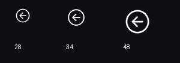

# 详情导航与菜单验收（2026-09-13）

改动基线：574780877d0d34a380221773b090f83e1e6cb7e0。

已完成：自有圆角无边框右键菜单、技能描述迁入公共tooltip、放大并重排模型和技能区、Host统一圆圈左箭头返回、移除LDT特性入口及字段展示。保留全局1.15缩放、模型交互、技能分组/准确ID、异步加载和聊天链接。

## 根因与回归边界

用户实机截图是原圆角未生效的证据。本机 EllesmereUIBlizzardSkin.lua:814 的 `_menuSkinFrame` 会改写原生菜单全部非自有纹理；827行加边框，830–853行在打开后安排三次延迟换肤。该安装文件SHA-256：`a2142e6586ea553610a505d808b4e7ed360354b9b4c77863e2fb60a95912e894`。此次未修改该文件或设置。

旧测试只调用 menuMixin.Generate，未覆盖后续换肤。新回归先在旧实现上失败，再验证生产菜单完全不进入被全局接管的原生Menu入口；验证真实按下/点击、旧按下失效、owner隐藏清理、20次复用无新增控件、18项完整可达、Esc优先关闭菜单、次要安全动作仍需后续硬件点击。离线替身不等于在游戏中执行 EllesmereUI 的换肤。

## 检查结果

`python tests/run.py --report analyze/tests/detail-navigation-final.json`：全量93/93通过，包含Lua/XML/Python静态检查、四产品装配、SDK、业务、UI、交付清单和性能。先前一轮91/93的失败项为动效替身缺少菜单接口及冷加载超限；补齐替身并清理公共组件重复探测/缓存/同色背景常量后通过，未改测试门槛。

- `LDT PASS: module=384.9 KiB query20_alloc=1191.6 KiB growth=0.0 KiB max_batch=3.00 ms spell_calls=81838 models=1`
- `Recent lifecycle: 100 cycles 234.000 ms total, 4.000 ms max, 24137.4 KiB allocated, -0.0 KiB retained growth, 0 new frames`
- `TOC loading files=100 cpu_ms=20.00 allocated_KiB=3527.0 retained_KiB=1473.9 frames=2 events=4`
- `TOC loading files=105 cpu_ms=24.00 allocated_KiB=4239.2 retained_KiB=1836.8 frames=2 events=4`

Host wowdoc validate：44个Lua文件，Encounters：14个Lua文件；12.1.0，无诊断。git diff --check通过。

布局专项验证模型/列表固定392内容高度、最多八行复用、长说明滚轮完整阅读、短说明恢复父级和宽度、异步数据只更新当前悬停、翻页/卸载关闭提示、设置和任意Provider详情统一返回且保留查询。impeccable机械扫描无发现；Lua几何与交互以源码和离线回归为准。

返回图标为原创几何SVG，工具生成64×64 RGBA TGA；28/34/48预览已检查，未添加游戏运行依赖。

## 版本化API证据

sourceId=wow-ui-source；product=retail；requestedRef=12.1.0；resolvedCommit=8ea15b61e45c0ed4eba01439c90757f86eb78d34。source list/check与精确inspect结果保存在本地analyze/tests/detail-navigation-*.json。

- `Interface/AddOns/Blizzard_APIDocumentationGenerated/SimpleScrollFrameAPIDocumentation.lua:91`，excerpt：`Name = "SetScrollChild"`；用于自有Frame的缩放、屏幕约束、滚动内容与字体区域父级，禁止战斗时打开或布局。
- `Interface/AddOns/Blizzard_APIDocumentationGenerated/SimpleFrameAPIDocumentation.lua:1470`，excerpt：`Name = "SetScale"`；用于自有Frame的缩放、屏幕约束、滚动内容与字体区域父级，禁止战斗时打开或布局。
- `Interface/AddOns/Blizzard_APIDocumentationGenerated/SimpleFrameAPIDocumentation.lua:381`，excerpt：`Name = "GetEffectiveScale"`；用于自有Frame的缩放、屏幕约束、滚动内容与字体区域父级，禁止战斗时打开或布局。
- `Interface/AddOns/Blizzard_APIDocumentationGenerated/SimpleFrameAPIDocumentation.lua:1206`，excerpt：`Name = "SetClampedToScreen"`；用于自有Frame的缩放、屏幕约束、滚动内容与字体区域父级，禁止战斗时打开或布局。
- `Interface/AddOns/Blizzard_APIDocumentationGenerated/SimpleScriptRegionAPIDocumentation.lua:592`，excerpt：`Name = "SetParent"`；用于自有Frame的缩放、屏幕约束、滚动内容与字体区域父级，禁止战斗时打开或布局。
- `Interface/AddOns/Blizzard_APIDocumentationGenerated/InputDocumentation.lua:20`，excerpt：`Name = "GetCursorPosition"`；返回鼠标坐标按菜单有效缩放换算。

## 实机与交付

本轮没有实机渲染、战斗/taint或游戏性能采样；最终圆角、中文游戏字体、模型裁切和小视口仍须游戏确认。仅已加载Lua与媒体变更，没有TOC或加载顺序变更，交付后使用/reload。提交成功后按发布清单覆盖五包180文件并核对全部SHA-256；保留目标额外旧文件、不推送远端。
